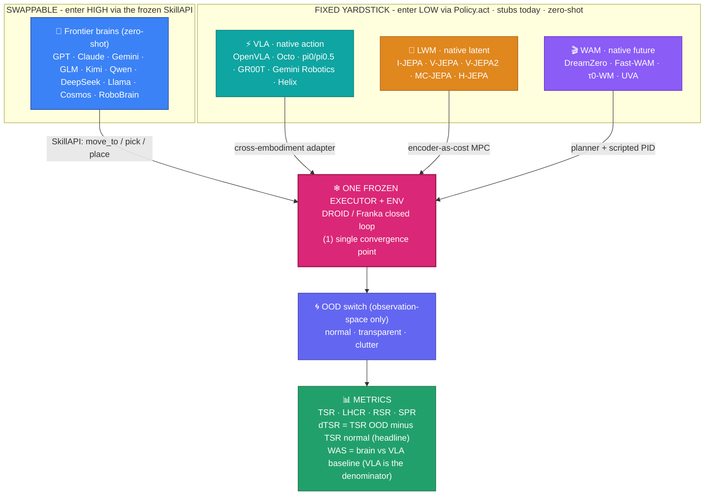

# RobotSurviveBench - system design

One frozen, **ZERO-SHOT** pipeline (inference only, no training): the 3 robot families (VLA, LWM, WAM) and every frontier brain run frozen - no fine-tuning, no gradient steps, no reward learning. The only per-family code is a thin adapter. Interactive version: `docs/` dashboard, tab **4 - System design**.

| 🧬 Lane | 🔹 Native output | 🔧 Adapter (the only per-family code) | 🧊 Zero-shot | 🤖 Example models | 📄 Code |
|---|---|---|---|---|---|
| 🧠 Frontier brains | 🗣️ language plan | none - enter HIGH via the frozen SkillAPI | ✅ | GPT, Claude, Gemini, GLM, Kimi, Qwen, DeepSeek, Llama, Cosmos, RoboBrain | [`brains/providers.py`](../../src/rsbench/brains/providers.py) |
| ⚡ VLA | 🎯 action | cross-embodiment (re-target action space) | ✅ | OpenVLA, Octo, pi0/pi0.5, GR00T, Gemini Robotics, Helix | [`baselines/base.py::Pi0Fast`](../../src/rsbench/baselines/base.py) 🩹 stub |
| 🧩 LWM | 🧠 latent z(obs) | encoder-as-cost MPC: argmin \|\|z(goal) - z(pred)\|\| | ✅ | I-JEPA, V-JEPA, V-JEPA2, MC-JEPA, H-JEPA | [`baselines/base.py::VJepa2AC`](../../src/rsbench/baselines/base.py) 🩹 stub |
| 🎬 WAM | 🎞️ predicted future | planner + scripted PID (rollout, plan, track) | ✅ | DreamZero, Fast-WAM, τ0-WM, UVA | [`baselines/base.py::DreamZero`](../../src/rsbench/baselines/base.py) 🩹 stub |

| 🧩 Idea / shared stage | 📍 What it means |
|---|---|
| 1️⃣ One convergence point | brains + all 3 families reduce to a low-level action into the SAME frozen executor + env; everything below it is shared and frozen |
| 2️⃣ Two entry heights | brains enter HIGH (SkillAPI `move_to`/`pick`/`place`); families enter LOW (`Policy.act` -> action); both meet at the executor |
| 3️⃣ Yardstick | `WAS = (success_model - success_VLAref) / (success_VLAref + eps)`; the 🟢 VLA lane is the denominator |
| 4️⃣ Honest status | the 3 families are 🩹 stubs today (`act()` raises with the checkpoint to wire); only the thin adapter is per-family code |
| ❄ Frozen + observation-only OOD | executor, OOD switch (normal/transparent/clutter), and metrics (TSR/LHCR/RSR/SPR, dTSR, WAS) are identical for every contestant; OOD changes only pixels, so it stays zero-shot |
