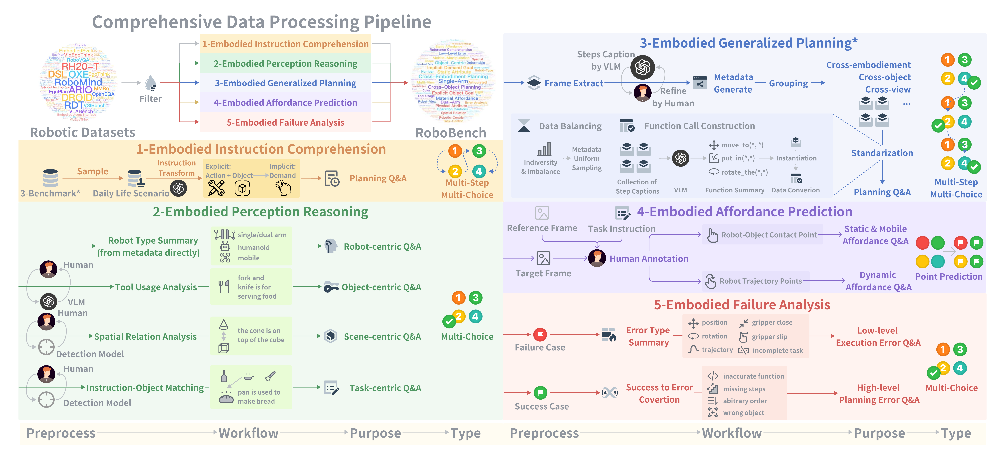
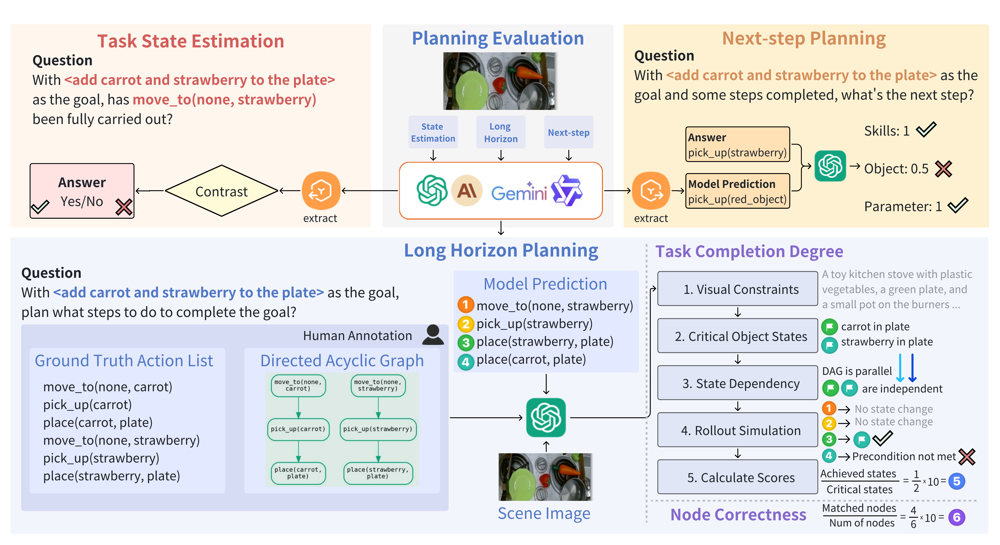
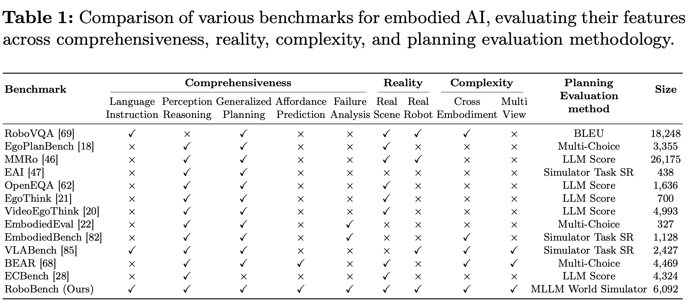
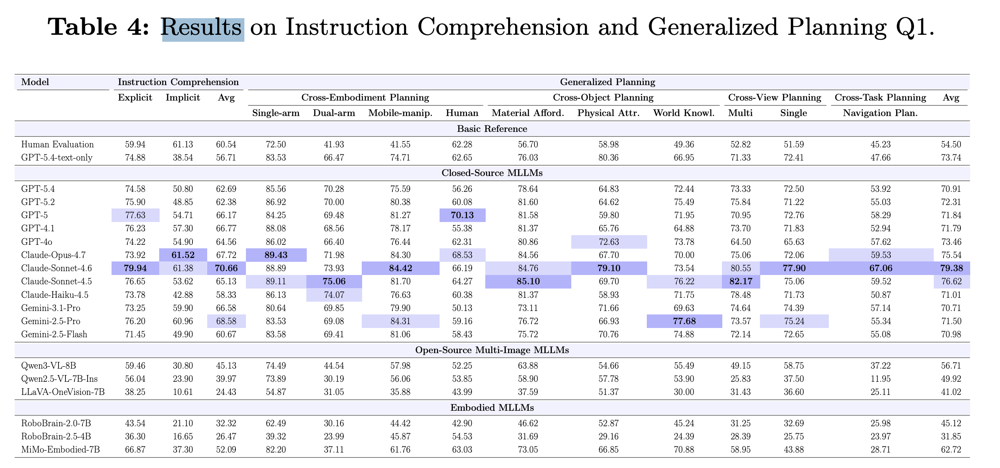

# 🧪 RoboBench (2510.17801) - v2 near-neighbor check

🎯 Closest near-neighbor, but **offline QA** (6092 pairs + MLLM-as-world-simulator), NOT live closed-loop execution -> v2 wedge HOLDS. 🔗 [abstract](https://arxiv.org/abs/2510.17801) · [pdf](https://arxiv.org/pdf/2510.17801)

## 📐 What RoboBench is + how it scores
| 🏷️ Aspect | 📄 Detail |
|---|---|
| 🧠 Subject | MLLMs as the "embodied brain" (System 2; System 1 = low-level control) |
| 📏 Scale | 5 dimensions · 14 capabilities · 25 tasks · **6092 QA pairs** · 18 SOTA MLLMs |
| 🗂️ Data | real robot sets ([RH20-T](https://arxiv.org/abs/2307.00595) · [DROID](https://huggingface.co/datasets/cadene/droid) · RoboMIND · [OXE](https://huggingface.co/datasets/jxu124/OpenX-Embodiment)) + in-house; cross embodiment/object/view |
| 🧭 5 dimensions | 🗣️ Instruction Comprehension · 👁️ Perception Reasoning · 🗺️ Generalized Planning · 🎯 Affordance Prediction · 🩺 Failure Analysis |
| ✅ Answer format | multiple-choice QA (A/B/C/D) + point/trajectory coordinate prediction |
| 🧮 Eval method | **MLLM-as-world-simulator** (Table 1 method = "MLLM World Simulator"), NOT Simulator Task SR; score = Task Completion Degree + Node Correctness |
| ❌ NOT present | no real/sim closed-loop control; no TSR from a physics rollout (teaser "closed-loop" arrows are scored as QA at each node) |
| 🔗 Downstream | QA score correlates with [CALVIN](https://arxiv.org/abs/2112.03227) execution (R=+0.9571, P=0.0002) |
| 🏆 Results | 🔒 Claude-Sonnet-4.6 **79.38** > GPT-5 71.84 > Gemini-2.5-Pro 71.50 · 🔓 Qwen3-VL-8B 56.71 · 🤖 MiMo-Embodied-7B 62.72 > RoboBrain-2.0-7B 45.12 (general frontier > small robot-brains) |
| 🔑 Weakness | all struggle: implicit instructions, spatiotemporal reasoning, cross-scenario planning, fine affordance, failure diagnosis |

## ✅ Novelty verdict for v2
| ❓ Question | ✅ Answer |
|---|---|
| 🔎 Offline QA (not live dTSR)? | YES - 6092 QA + MLLM-world-simulator; relevance via CALVIN correlation, not execution |
| 🛡️ v2 wedge survives? | YES - v2 = DIRECT closed-loop EXECUTION + LIVE cadence + OOD-survival (dTSR) |
| 🚫 Do NOT claim | "first to benchmark MLLM-brains" - RoboBench owns the QA version; CITE it |
| ✂️ Our sharpened edge | execution (not QA / not simulated plans) · live auto-integrate · observation-OOD survival |
| 🎁 Bonus | RoboBench R=0.96 (brain-QA predicts CALVIN) MOTIVATES v2: measure execution directly, under OOD |

## 🖼️ Figures (`../competitor/c1_RoboBench/`)

