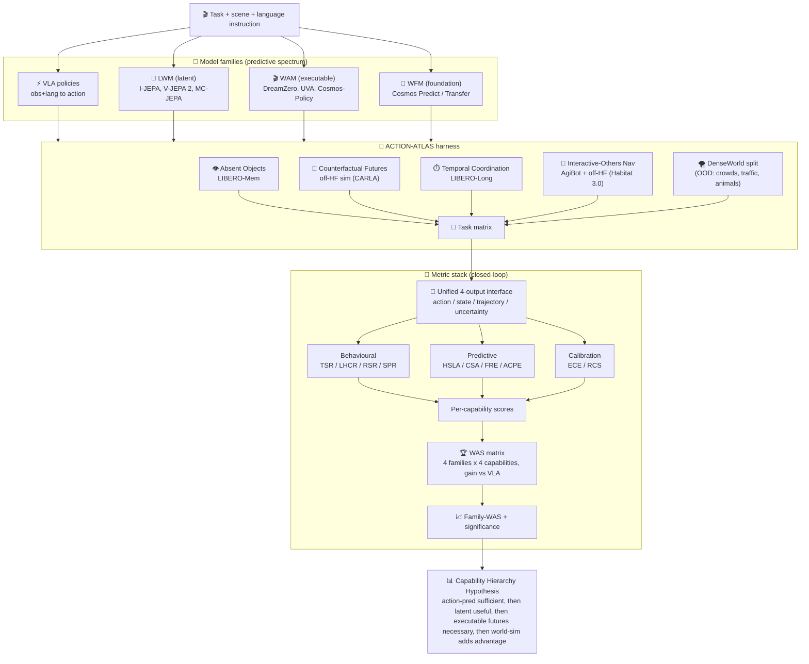
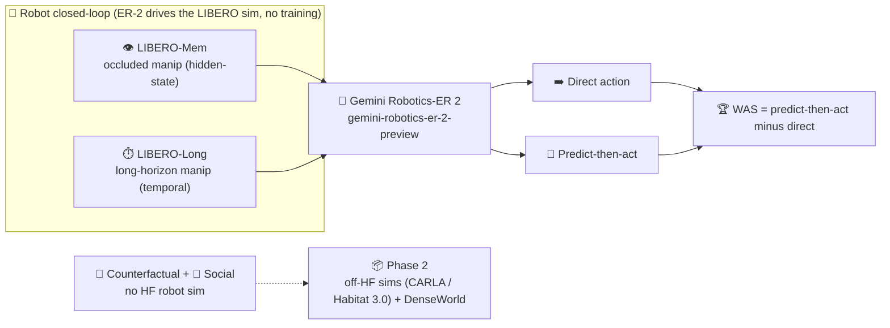

# 🏗️ ACTION-ATLAS: Engineering Plan (retired full-benchmark vision, Phase-2+ reference)

🎯 Aspirational full-benchmark design, retired as a standalone paper (no defensible novelty left) and kept as Phase-2+ reference; to BUILD now follow `../v2/README.md`, and see `plan_rejections_risks.md` for the scoop detail.

## 🧮 Capability x family x predictive-demand matrix (the γ view)
🎯 Each cell = WAS(family, capability), the closed-loop advantage over ⚡VLA; organising view only - [V-JEPA-2-AC](https://arxiv.org/abs/2506.09985) + [WorldArena](https://arxiv.org/abs/2602.08971) already build this comparison, and WFM has no zero-shot action instance. (Legend: ++ large / + moderate / ~ marginal / 0 baseline WAS.)

| 🎯 Domain | 🗂️ Dataset (HF) | 💥 Where ⚡VLA breaks | 🧬 Family demanded | 📏 Metric | 🧮 γ WAS (⚡/🧠/🎬/🌌) | 🔮 Predictive-demand (Hidden/CF/Long/Social) | 🔑 Hypothesised finding |
|---|---|---|---|---|---|---|---|
| 👁️ **Absent Objects** (hidden-state) | **LIBERO-Mem** (`lerobot/libero`) | no memory of unseen state | 🧠 **LWM** | **HSLA** + WAS | 0 / ++ / + / + | High / Low / Moderate / Low | prediction first pays off (Finding II) |
| 🔮 **Counterfactual Futures** | off-HF (CARLA / MetaDrive) + **DenseWorld** | cannot roll out alternatives | 🎬 **WAM** | **CSA** / RSR + WAS | 0 / + / ++ / ++ | Moderate / High / Moderate / Low | needs executable futures (Finding III) |
| ⏱️ **Temporal Coordination** | **LIBERO-Long** (`lerobot/libero`) | drifts / drops sub-goals | 🎬 **WAM** -> 🌌 **WFM** | **LHCR** + WAS | 0 / + / ++ / ++ | Moderate / Moderate / High / Moderate | multi-stage planning gain |
| 👥 **Interactive-Others Nav (ION)** | **AgiBot** (`agibot-world`) + off-HF (Habitat 3.0) + **DenseWorld** | ignores others' intent | 🌌 **WFM** | **SPR** + WAS | 0 / ~ / + / ++ | High / High / High / High | social needs world-sim (Finding IV); ION = predictive-demand-maximal |
| ⚡ **Direct action** (baseline) | n/a (reference policy) | n/a (reference) | ⚡ **VLA** | task success (WAS denominator) | 0 (ref) | n/a | action-pred stays surprisingly strong (Finding I) |

## 📋 Design, models, metrics, phasing, reviewer-proofing
| 🗂️ Aspect | 📄 Detail |
|---|---|
| ⛔ Reality correction (2026-08-12) | no standalone novelty; WFM (Cosmos) cannot act zero-shot so it is 3 families (⚡🧠🎬) not 4; DenseWorld zero-shot nav infeasible (Phase-3); WAS = renamed embodied-utility gain; cross-family closed-loop already exists ([V-JEPA-2-AC](https://arxiv.org/abs/2506.09985) baselines, [WorldArena](https://arxiv.org/abs/2602.08971)) |
| ✅ Honest deliverable | neutral WAS assessment (credit priors) + 3-model zero-shot table (π0-FAST / V-JEPA-2-AC / DreamZero) on one DROID/Franka arm; measurement/consolidation, not novelty |
| 🧭 Design principles | (I) capability before architecture; (II) closed-loop eval (prediction != behaviour); (III) behavioural burden of proof (prediction -> better decisions -> better outcomes) |
| 🧬 Model families (per-family zero-shot ckpt) | ⚡ VLA = π0-FAST (OpenVLA WidowX-only) · 🧠 LWM = V-JEPA-2-AC (I-JEPA/V-JEPA2/MC-JEPA are encoders, no action) · 🎬 WAM = DreamZero (UVA/Cosmos-Policy need post-training) · 🌌 WFM = Cosmos (video-only, [WorldBench](https://world-bench.github.io/)). Net 3 of 9 native -> 3 native / 11 of 15 with the interface layer (see `plan_dataset.md`) |
| 📏 Metric stack | behavioural (TSR, LHCR, RSR, SPR) -> predictive (HSLA, CSA, FRE, ACPE) -> calibration (ECE, RCS) -> WAS(c,m) = (S - S_VLA)/(S_VLA+eps); headline dWAS = WAS(OOD) - WAS(normal). Finding V: prediction quality != behavioural utility |
| 🎯 Sub-tasks (5 per domain) | 👁️ hidden-object retrieval, object permanence, occluded manip, delayed re-id, multi-room search · 🔮 route replanning, dynamic obstacle avoidance, alt manipulation, intervention planning, failure recovery · ⏱️ table prep, kitchen org, assembly, warehouse fulfilment, multi-stage delivery · 👥 pedestrian crossing, crowd nav, multi-agent path planning, vehicle interaction, animal-aware nav |
| 🔌 Unified 4-output interface | Action / State / Trajectory / Uncertainty per task, every family = enables the cross-family γ comparison + calibration |
| 🌪️ DenseWorld stress split (own data, OOD) | crowds, mixed traffic, rickshaws/buses, vendors, pedestrians, animals, weather; stresses uncertainty + interaction density + long-range deps; doubles as CoRL/RSS real-world evidence |
| 🧱 Aspirational contributions (all scooped) | behavioural WM hypothesis (3 principles); ACTION-ATLAS 4 domains + DenseWorld; γ cross-tab; unified 4-output interface; WAS + 10-metric suite |
| 🚀 Phasing rationale | validate WAS + harness + task difficulty cheaply (zero training) via hosted APIs first; spend GPUs on open weights only once the numbers are trusted |
| ⚡ VLA phasing | P1: Gemini Robotics-ER 2 planner (`gemini-robotics-er-2-preview`) + reactive VLM as policy · P2: OpenVLA, π0, RT-2-style |
| 🧠 LWM phasing | P1: proxy only (prompt an API model to predict a latent state, then act) · P2: V-JEPA 2 / V-JEPA-2-AC, I-JEPA, MC-JEPA (no chat API) |
| 🎬 WAM phasing | P1: proxy only (prompt an API model to imagine subgoals/frames, then act) · P2: UVA, DreamZero, Cosmos-Policy |
| 🌌 WFM phasing | P1: Gemini video understanding · P2: Cosmos Predict/Transfer (no zero-shot action-conditioned rollout) |
| ⚠️ Phasing caveat | LWM/WAM/WFM have no chat API, so Phase 1 does NOT rank the real families - it validates metric/harness/difficulty; family ranking is a Phase-2 result |
| 🆕 Reviewer-proofing: novelty | do NOT claim it - [V-JEPA-2-AC](https://arxiv.org/abs/2506.09985) + [WorldArena](https://arxiv.org/abs/2602.08971) already build the cross-family closed-loop comparison; frame as measurement/consolidation; WFM = video-quality reference only |
| 🧪 Reviewer-proofing: ablations | fixed compute budget B (log FLOPs/params/data-hours); >=5 seeds + 95% CI + named significance test; ablate each metric layer; add human/oracle ceiling + blind floor; report all 10 metrics |
| 🗃️ Reviewer-proofing: dataset+artifact | datasheet (provenance/counts/splits/licence/ethics); executable code + harness; host with Croissant + maintenance + reviewer URL; reproducibility checklist (non-executable = desk-reject) |
| 🤖 Reviewer-proofing: real-robot | >=1 real-robot slice (DenseWorld) or sim-to-real study, or argue data-efficiency value; gate physical-robot claims to Phase 2 |
| 🎯 Reviewer-proofing: venue | target NeurIPS Evaluations & Datasets (2026); CoRL/RSS demand real-robot; ARR is the weakest fit |

## 🗺️ System design / evaluation flow

## 🔌 Phase-1 wiring: Gemini Robotics-ER 2 only (API, no training)

