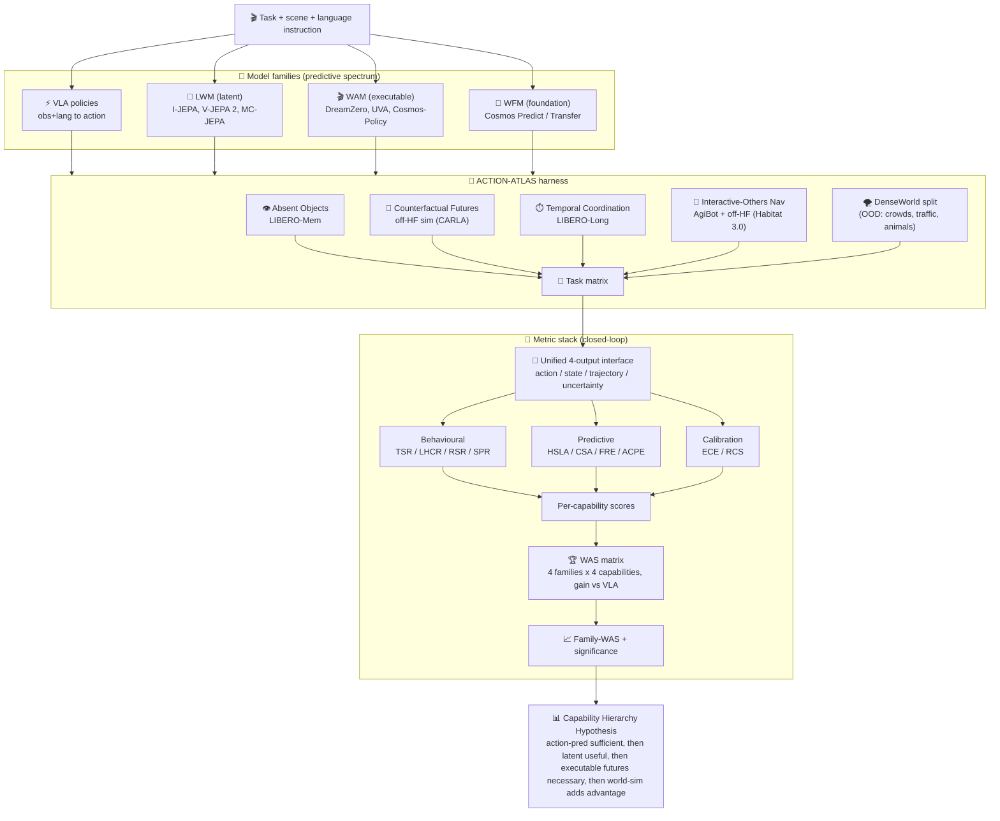
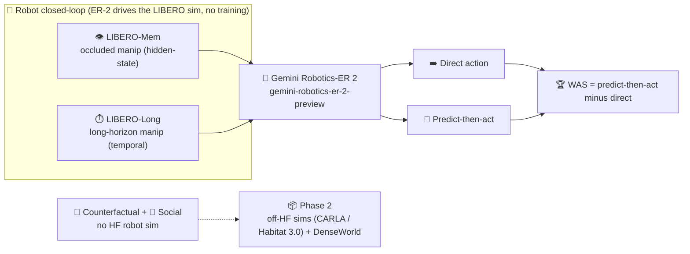

# 🏗️ ACTION-ATLAS: Engineering Plan (Full-Benchmark Paper)

> 🎯 **FOCUS: Benchmarking Zero-shot (No training) ROBOTIC EXECUTION ONLY.** Every task is a frozen checkpoint acting in a closed loop; no fine-tuning, no video-QA, no open-loop prediction scoring, no non-robot tasks.
>
> ⛔ **REALITY CORRECTION (2026-08-12, web-verified; see `plan_rejections_risks.md`).** As a standalone benchmark this has **no defensible novelty left** - every wedge below is already published. The design in this file is the **aspirational full-benchmark vision**, retired as a standalone paper and kept only as a Phase-2+ reference.
> - 🌌 **WFM (Cosmos) cannot act zero-shot** (video-only): the "4-family" γ matrix is really **3 families** (⚡ VLA, 🧠 LWM, 🎬 WAM).
> - 🗺️ **DenseWorld zero-shot nav is infeasible** (no family drives without a trained action head + photoreal recon): it is a training-heavy Phase-3, NOT zero-shot execution.
> - 📏 **WAS** = a rename of existing embodied-utility gain (World-in-World, DreamZero "2x", L0-L7 ladder); the cross-family closed-loop comparison already exists ([V-JEPA-2-AC](https://arxiv.org/abs/2506.09985) baselines, [WorldArena](https://arxiv.org/abs/2602.08971)); capability-slicing, calibration, and the unified harness are each taken (RoboWM-Bench, TD-Calibration, RoboDojo XPolicyLab).
> - ✅ **Honest deliverable:** the benchmark paper is a neutral **WAS assessment** (credit priors) + a small **3-model zero-shot table (π0-FAST / V-JEPA-2-AC / DreamZero) on one shared DROID/Franka arm**, claimed as measurement/consolidation, not novelty.
>
> 📦 **Scope note:** this file is the aspirational full-benchmark reference (Phase-2+); the near-term work is the 3-model DROID/Franka reproduction below. 👉 **To BUILD now, follow `../v2/README.md` (concise, actionable). This file is reference, not a build guide.**
>
> 🧭 **Design principles (unchanged, still sound):** (I) capability before architecture; (II) closed-loop evaluation (prediction ≠ behaviour); (III) behavioural burden of proof (prediction → better decisions → better outcomes).
>
> 🧪 **Aspirational hypothesis (Phase-2+, kept for reference):** predictive world-modelling matters *only* where it improves embodied decision-making; the capability × family γ matrix below scores this with WAS. Not a near-term novelty claim.

## 🧮 Capability × model-family matrix (the empty γ cell)

> Each cell = **WAS(family, capability)**: the closed-loop advantage of that family over the ⚡VLA baseline on that capability. ⛔ *Reality:* a cross-family closed-loop comparison is **not** an unfilled cell - [V-JEPA-2-AC](https://arxiv.org/abs/2506.09985)'s own baselines and [WorldArena](https://arxiv.org/abs/2602.08971) already build it. Treat this matrix as an organising view for the benchmark's WAS *assessment*, not a novel contribution. 🌌 WFM has no zero-shot action instance, so its column is a video-quality reference only ([WorldBench](https://world-bench.github.io/)), not a robot.

| 🎯 Capability ↓ / 🧬 Family → | ⚡ VLA *(baseline)* | 🧠 LWM (latent) | 🎬 WAM (executable) | 🌌 WFM (generative) |
|---|---|---|---|---|
| 👁️ **Absent Objects** (hidden-state) | 0 (ref) | ++ *(memory pays off first)* | + | + |
| 🔮 **Counterfactual Futures** | 0 | + | ++ *(needs executable rollouts)* | ++ |
| ⏱️ **Temporal Coordination** | 0 | + | ++ | ++ |
| 👥 **Interactive-Others Nav (ION)** | 0 | ~ | + | ++ *(world-sim of others)* |

*Legend:* `++` large positive WAS · `+` moderate · `~` marginal · `0` baseline. The staircase (LWM first helps hidden-state, WAM helps counterfactual + temporal, WFM helps social) **is** the Capability Hierarchy Hypothesis, stated as a testable matrix.

*Datasets (robot only, no video-QA):* 👁️ Absent Objects = **LIBERO-Mem** · ⏱️ Temporal = **LIBERO-Long** (LIBERO sim, closed-loop). 🔮 Counterfactual + 👥 ION have **no HF robot sim**, so they use off-HF sims (CARLA / Habitat 3.0) + the purpose-built **DenseWorld** split (own data: crowds, traffic, animals).

## 📋 Per-capability detail

| 🎯 Capability domain (β) | 🗂️ Dataset (HF) | 🧪 What it stresses | 💥 Where direct ⚡VLA breaks | 🧬 Family the hierarchy demands | 📏 Primary metric | 🔑 Hypothesised finding |
|---|---|---|---|---|---|---|
| 👁️ **Absent Objects** | **LIBERO-Mem** (`lerobot/libero`) | hidden-state reasoning, object permanence, partial observability | no memory of unseen state | 🧠 **LWM** (latent prediction *useful*) | **HSLA** + WAS | prediction first pays off here (Finding II) |
| 🔮 **Counterfactual Futures** | off-HF sim (CARLA / MetaDrive) + **DenseWorld** | evaluating "what-if" alternatives *before* acting | cannot roll out alternatives | 🎬 **WAM** (executable futures *necessary*) | **CSA** / RSR + WAS | needs executable futures (Finding III) |
| ⏱️ **Temporal Coordination** | **LIBERO-Long** (`lerobot/libero`) | long-horizon, multi-stage execution | drifts / drops sub-goals | 🎬 **WAM** → 🌌 **WFM** | **LHCR** + WAS | multi-stage planning gain |
| 👥 **Interactive-Others Nav (ION)** | **AgiBot** (`agibot-world`) + off-HF (Habitat 3.0) + **DenseWorld** | social forecasting, multi-agent interaction | ignores others' intent | 🌌 **WFM** (world simulation *adds advantage*) | **SPR** + WAS | social needs world-sim (Finding IV) |
| ⚡ *(baseline)* **Direct action** | n/a (reference policy on each) | reactive obs+language → action | n/a (this is the reference) | ⚡ **VLA** | task success (WAS denominator) | action-prediction stays *surprisingly strong* (Finding I) |

🧬 **Model families and per-model zero-shot compatibility (web-verified + audited):** only the *action-emitting, zero-shot-on-DROID/Franka* checkpoint per family qualifies. ⚡ **VLA** = **π0-FAST** ✅ (OpenVLA acts but is WidowX-only → needs Franka fine-tuning ❌) · 🧠 **LWM** = **V-JEPA-2-AC** ✅ (image-goal MPC; plain **I-JEPA / V-JEPA 2 / MC-JEPA are encoders with NO action output** ❌) · 🎬 **WAM** = **DreamZero** ✅ (UVA + Cosmos-Policy act but need per-embodiment post-training ❌) · 🌌 **WFM** = Cosmos (video-only, no zero-shot action ❌). **Net: only 3 of 9 listed models run zero-shot on the shared arm - π0-FAST, V-JEPA-2-AC, DreamZero.** (Over the full 15-model roster this is **3 native → 11 of 15** once the training-free interface layer is added; see `plan_dataset.md`.)
📏 **Metric stack:** behavioural (TSR, LHCR, RSR, SPR) → predictive (HSLA, CSA, FRE, ACPE) → calibration (ECE, RCS) → per-capability score S(c,m) → 🏆 **WAS**(c,m) = (S(c,m) - S(c,VLA)) / (S(c,VLA)+ε) → family-level WAS + bootstrap 95% CI + effect sizes. The benchmark **headline is dWAS = WAS(OOD) - WAS(normal)** (did the edge survive the surprise?); see `plan_dataset.md`.
⚠️ **Cross-cutting (Finding V):** prediction quality ≠ behavioural utility; a visually great rollout can still pick worse actions.

## 🧩 Benchmark internals (ACTION-ATLAS design)

**🎯 Sub-tasks (5 per domain):** 👁️ Absent Objects: hidden-object retrieval · object permanence · occluded manipulation · delayed re-identification · multi-room search. 🔮 Counterfactual: route replanning · dynamic obstacle avoidance · alternative manipulation · intervention planning · failure recovery. ⏱️ Temporal: table preparation · kitchen organisation · assembly · warehouse fulfilment · multi-stage delivery. 👥 ION: pedestrian crossing · crowd navigation · multi-agent path planning · vehicle interaction · animal-aware navigation.

**🧮 Capability × predictive-demand (a second, orthogonal matrix):** each domain loads differently on the underlying predictive demands.

| Domain | Hidden-state | Counterfactual | Long-horizon | Social |
|---|---|---|---|---|
| 👁️ Absent Objects | High | Low | Moderate | Low |
| 🔮 Counterfactual | Moderate | High | Moderate | Low |
| ⏱️ Temporal | Moderate | Moderate | High | Moderate |
| 👥 ION | High | High | High | High |

ION loads **High on all four** = the predictive-demand-maximal domain.

**🔌 Unified 4-output interface (per task, every family):** (i) **Action**, (ii) **State** (predicted future state), (iii) **Trajectory** (predicted rollout), (iv) **Uncertainty** (confidence / calibration). This common schema is what makes the cross-family γ comparison *and* calibration possible; it is the interface novelty World-in-World's single action-API lacks.

**🌪️ DenseWorld stress split (own data, OOD):** crowded marketplaces, mixed traffic, rickshaws / buses, street vendors, pedestrians, domestic animals, weather / lighting variation. Emphasises uncertainty, interaction density, long-range dependencies; exposes predictive failures hidden in structured indoor scenes. This is the purpose-built own-data slice (no HF set provides it) and doubles as the CoRL/RSS real-world evidence.

## 🗺️ System design / evaluation flow

### 🧱 Aspirational contributions (⛔ all scooped as standalone novelty - see the reality banner; kept as Phase-2+ reference)
1. 🧪 World-modelling hypothesis as a **behavioural** claim (3 design principles).
2. 🗺️ **ACTION-ATLAS**: 4 capability domains (5 sub-tasks each) + the **DenseWorld** OOD split, organised by capability not architecture.
3. 🧮 The **γ capability × model-family** cross-tab (plus the orthogonal capability × predictive-demand matrix) that no prior benchmark fills.
4. 🔌 A **unified 4-output interface** (action / state / trajectory / uncertainty) enabling cross-family and calibration comparison.
5. 🏆 **WAS** + the full 10-metric suite (behavioural / predictive / calibration) with the formula `WAS=(S-S_VLA)/(S_VLA+ε)`.

## 🚀 Phased evaluation: API-first (inference only), then open-source

🎯 **Why:** validate the WAS metric, the closed-loop harness, and task difficulty **cheaply, with zero training**, by calling hosted APIs. Only once the team trusts the numbers do we spend GPUs on open-weight families.

🔌 **Phase 1 (inference-only, API).** Anchor on **Gemini Robotics-ER 2** (embodied-reasoning "brain": spatial reasoning + multi-step planning; text/image/video/audio in, function-calling out; hands motor execution to a VLA). Each capability task runs as perceive, then optionally predict, then plan, then act, entirely through API calls. Compute WAS with **no weights of our own**, two ways:
> - within-model ablation: **direct-answer (VLA-style) vs predict-then-act (world-model-style)** prompting on the *same* model.
> - cross-model: an embodied reasoner (Gemini Robotics-ER 2) vs a reactive VLM (Gemini 2.x / GPT / Claude).

📦 **Phase 2 (scale, open weights, GPUs).** Replace the proxies with the *real* family spectrum and run true closed-loop rollouts on the identical harness + WAS.

| 🧬 Family | 🔌 Phase 1 (API, no training) | 📦 Phase 2 (open weights, GPUs) | 📝 Note |
|---|---|---|---|
| ⚡ **VLA** (direct) | **Gemini Robotics-ER 2** planner + reactive VLM (Gemini 2.x / GPT / Claude) as zero-shot policy | OpenVLA, π0, RT-2-style | ER-2 is the anchor endpoint `gemini-robotics-er-2-preview` |
| 🧠 **LWM** (latent) | *proxy only*: prompt an API model to predict a textual/latent state, then act | V-JEPA 2 / V-JEPA-2-AC, I-JEPA, MC-JEPA | JEPA has no chat API; Phase 1 only proxies the predict-then-act role |
| 🎬 **WAM** (executable) | *proxy only*: prompt an API model to imagine next subgoals/frames, then act | UVA, DreamZero, Cosmos-Policy | real action-conditioned rollout needs open weights |
| 🌌 **WFM** (generative) | Gemini video *understanding*; optional hosted video-gen API | Cosmos (Predict / Transfer), open video WMs | Gemini reads video but does not roll out action-conditioned futures |

⚠️ **Honest caveat (put it in the paper):** LWM / WAM / WFM have **no chat API** (weight-only), so Phase 1 does **not** rank the real families; it validates the *metric, harness, and task difficulty*. Family ranking is a Phase-2 result. That is a feature: reviewers see the pipeline works before the expensive runs.

💰 **Cost:** Phase 1 = API tokens only, runs on a laptop; Phase 2 = cluster + open weights.

### 🔌 Phase-1 wiring: Gemini Robotics-ER 2 only (API, no training)

*Robot-only: Phase 1 runs a genuine closed loop only where HF has a sim, so **LIBERO** drives hidden-state (LIBERO-Mem) and temporal (LIBERO-Long) with Gemini-ER2 as planner (direct-vs-predict = WAS, zero training). **Counterfactual and social have no HF robot sim** and move to Phase 2 (off-HF sims CARLA/Habitat 3.0 + the own-built DenseWorld). No video-QA: ACTION-ATLAS scores robot behaviour, not video question-answering.*

## 🛡️ Reviewer-proofing engineering steps (ICML / CVPR / ICCV / NeurIPS D&B / CoRL)

🆕 **Novelty - ⛔ do NOT claim it (the "done before" citations exist; see the scoop table in `plan_rejections_risks.md`):**
1. Do NOT label the γ cell as a novel contribution - [V-JEPA-2-AC](https://arxiv.org/abs/2506.09985) baselines + [WorldArena](https://arxiv.org/abs/2602.08971) already build a cross-family closed-loop comparison. Use the matrix only as an organising view for the benchmark's WAS assessment.
2. Keep a positioning table, but honestly: rows = World-in-World / WorldArena / V-JEPA-2-AC / RoboDojo / RoboWM-Bench; it shows we are one column among many, not the only filled column.
3. Frame the deliverable as measurement/consolidation (a 3-model DROID/Franka zero-shot reproduction: π0-FAST / V-JEPA-2-AC / DreamZero), the benchmark paper's core result.
4. WFM has no zero-shot action instance, so report it only as a video-quality reference (WorldBench), never as a robot column.

🧪 **Ablations (ICML/CVPR bar):**
1. Fix one compute/data budget B; adapt every family to B; log FLOPs + params + data-hours per run; report WAS **only** within matched B.
2. Run ≥5 seeds per (family, capability); report mean + 95% CI; name the significance test and its assumptions.
3. Ablate each metric-stack layer (behavioural / predictive / calibration) to show its marginal contribution to WAS.
4. Add a human (or oracle-policy) ceiling and a random/blind floor per capability.
5. Ablate the capability-score weights `w_j`; report all 10 named metrics (TSR/LHCR/RSR/SPR · HSLA/CSA/FRE/ACPE · ECE/RCS), not just WAS.

🗃️ **Dataset + artifact (NeurIPS D&B desk-reject triggers):**
1. Ship a datasheet: provenance, counts, splits, licence, ethics, intended use.
2. Release executable + documented code and the eval harness; host data on HF/Dataverse with **Croissant** metadata + a maintenance plan + a reviewer-access URL.
3. Complete the reproducibility checklist; a non-executable repo is an auto desk-reject.

🤖 **Real-robot (CoRL/RSS expectation):**
1. Add at least one real-robot capability slice (the **DenseWorld** OOD split), or a sim-to-real transfer study, or explicitly argue data-efficiency/analysis value.
2. Keep Phase 1 (API/sim) as validation; gate physical-robot claims to Phase 2.

🎯 **Venue:** target **NeurIPS Evaluations & Datasets Track (2026)** first (evaluation + benchmark, sim-friendly, explicit criteria); CoRL/RSS demand real-robot; ARR (NLP) is the weakest fit.
