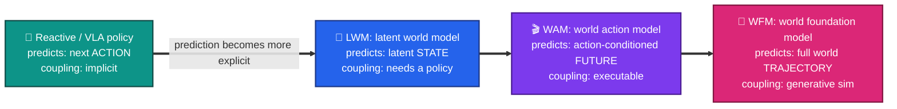
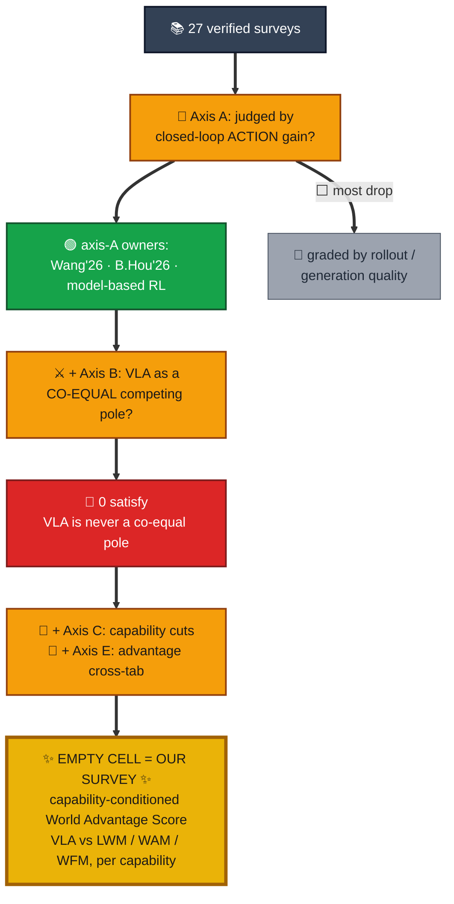
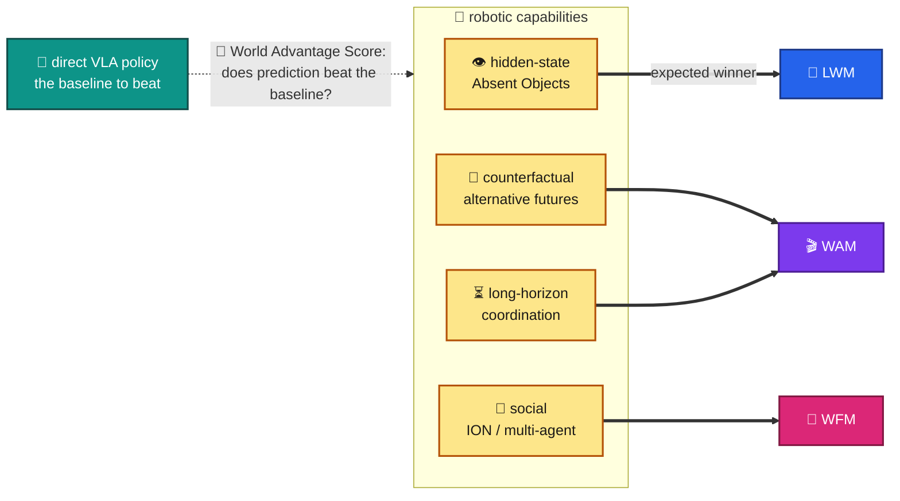

# 🧭📚 Novelty scan: predictive embodied intelligence (VLA vs world models), capability-centric

🎯 **Topic** (derived from `p2_ACTION_ATLAS_ARXIV.md`): a survey of **predictive embodied intelligence** 🤖 that asks *which robotic capabilities require which form of world modeling* (latent 🧠 LWM / action-conditioned 🎬 WAM / generative 🌌 WFM), and *when* prediction beats direct **Vision-Language-Action (VLA)** policies ⚡, judged by closed-loop behavior. 🔁

🔬 **Method:** 4 parallel research agents 🤖🤖🤖🤖 (world-models 🌍 · VLA 🦾 · foundation-models+eval 🏗️ · predictive/video-world-models 🎥), each web-verifying 🌐 every candidate against its arXiv abstract page / journal DOI. 📥 32 hits, deduped to 26 unique verified surveys ✅ (+1 added post-audit).

## 📚 Surveys found (27 verified ✅, 1 flagged ⚠️)

### 🌍 World models (robotics / embodied / model-based)
| # | Title | First author | Year | Venue | ID |
|--:|---|---|--:|---|---|
| 1 | 🌐 World Models for Robotic Manipulation: A Survey | Fangyuan Wang | 2026 | arXiv | 2606.00113 |
| 2 | 🔮 Understanding World or Predicting Future? A Comprehensive Survey of World Models | Jingtao Ding | 2024/25 | 🏅 ACM CSUR | 2411.14499 / 10.1145/3746449 |
| 3 | 🧠 A Comprehensive Survey on World Models for Embodied AI | Xinqing Li | 2025 | arXiv | 2510.16732 |
| 4 | 🤖 World Model for Robot Learning: A Comprehensive Survey | Bohan Hou | 2026 | arXiv | 2605.00080 |
| 5 | 🏛️ World Models: A Comprehensive Survey of Architectures, Methodologies, Reasoning Paradigms, and Applications | Arif Hassan Zidan | 2026 | arXiv | 2606.00133 |
| 6 | 🎮 Model-based Reinforcement Learning: A Survey | Thomas M. Moerland | 2020/23 | 🏅 Found. & Trends ML | 2006.16712 / 10.1561/2200000086 |
| 7 | 🚗 A Survey of World Models for Autonomous Driving | Tuo Feng | 2025 | arXiv (driving) | 2501.11260 |
| 8 | 🚗 The Role of World Models in Shaping Autonomous Driving: A Comprehensive Survey | Sifan Tu | 2025 | arXiv (driving) | 2502.10498 |

### 🦾 Vision-Language-Action / generalist robot policies
| # | Title | First author | Year | Venue | ID |
|--:|---|---|--:|---|---|
| 9 | 🧭 A Survey on Vision-Language-Action Models for Embodied AI | Yueen Ma | 2024 | 🏅 IEEE TNNLS (early) | 2405.14093 |
| 10 | 📈 Vision-Language-Action Models: Concepts, Progress, Applications and Challenges | Ranjan Sapkota | 2025 | arXiv | 2505.04769 |
| 11 | 🔤 A Survey on Vision-Language-Action Models: An Action Tokenization Perspective | Yifan Zhong | 2025 | arXiv | 2507.01925 |
| 12 | 🔧 Vision Language Action Models in Robotic Manipulation: A Systematic Review | Muhayy Ud Din | 2025 | Ann. Reviews in Control (sub.) | 2507.10672 |
| 13 | 👁️ Large VLM-based Vision-Language-Action Models for Robotic Manipulation: A Survey | Rui Shao | 2025 | arXiv | 2508.13073 |
| 14 | 🧩 Pure Vision Language Action (VLA) Models: A Comprehensive Survey | Dapeng Zhang | 2025 | arXiv | 2509.19012 |
| 15 | ⚡ A Survey on Efficient Vision-Language-Action Models | Zhaoshu Yu | 2025 | arXiv | 2510.24795 |

### 🏗️ Foundation models for robotics + embodied-AI evaluation
| # | Title | First author | Year | Venue | ID |
|--:|---|---|--:|---|---|
| 16 | 🏗️ Foundation Models in Robotics: Applications, Challenges, and the Future | Roya Firoozi | 2023/24 | 🏅 IJRR | 2312.07843 / 10.1177/02783649241281508 |
| 17 | 🤖 Toward General-Purpose Robots via Foundation Models: A Survey and Meta-Analysis | Yafei Hu | 2023 | arXiv | 2312.08782 |
| 18 | 🗣️ Large Language Models for Robotics: A Survey | Fanlong Zeng | 2023 | arXiv | 2311.07226 |
| 19 | 🔧 What Foundation Models can Bring for Robot Learning in Manipulation: A Survey | Dingzhe Li | 2024 | arXiv | 2404.18201 |
| 20 | 🧪 A Survey of Embodied AI: From Simulators to Research Tasks | Jiafei Duan | 2022 | 🏅 IEEE TETCI | 2103.04918 / 10.1109/TETCI.2022.3141105 |
| 21 | 📊 A Survey on Evaluation of Embodied AI | Liyu Hou | 2026 | Authorea (preprint) | 10.22541/au.176851544.45077723 |
| 22 | 🎓 Robotic Manipulation via Imitation Learning: Taxonomy, Evolution, Benchmark, and Challenges | Zezeng Li | 2025 | arXiv | 2508.17449 |

### 🎥 Predictive representation / generative video "world foundation models"
| # | Title | First author | Year | Venue | ID |
|--:|---|---|--:|---|---|
| 23 | 🎬 Sora as a World Model? A Complete Survey on Text-to-Video Generation | Fachrina Dewi Puspitasari | 2024 | arXiv | 2403.05131 |
| 24 | 🧬 A Survey on Joint Embedding Predictive Architectures and World Models | Shamyo Brotee | 2025 | SSRN | SSRN 5772122 |
| 25 | 🕹️ Towards Interactive Video World Modeling: Frontiers, Challenges, Benchmarks, Future Trends | Jiuming Liu | 2026 | arXiv | 2606.01164 |
| 26 | 🌐 A Survey: Learning Embodied Intelligence from Physical Simulators and World Models | Xiaoxiao Long | 2025 | arXiv | 2507.00917 |

### 🔍 Nearest-neighbors added after the adversarial audit
| # | Title | First author | Year | Venue | ID | Note |
|--:|---|---|--:|---|---|---|
| 27 | 👣 A Step Toward World Models: A Survey on Robotic Manipulation | Peng-Fei Zhang | 2025 | arXiv | 2511.02097 | ✅ Verified. Does not fill the gap: treats VLA as a *form* of world modeling (axis B absent ⬜), capability axis only partial 🟡 (long-horizon). |
| -- | ❓ A Survey of Embodied World Models | Yu Shang | 2025 | ResearchGate (no arXiv ID confirmed) | -- | ⚠️ **Flagged, UNVERIFIED id.** Has the landscape's most explicit VLA-vs-world-model comparison but frames them as complementary/parallel and is generation-quality organized (axis A/C absent as spine). Position against in related work; do NOT cite until an arXiv ID/DOI is confirmed. 🚫 |

## 📊 Coverage matrix

📋 Columns = the 12 closest surveys. Rows = candidate organizing axes. 🔑 **Legend:** ✅ = `covered` (the survey's own spine) · 🟡 = `partial` (touched but not organizing) · ⬜ = `absent`.

| Organizing axis \ Survey | Wang'26 (2606.00113) | Ding'24 CSUR (2411.14499) | X.Li'25 (2510.16732) | B.Hou'26 (2605.00080) | Zidan'26 (2606.00133) | Moerland'20 (2006.16712) | Ma'24 (2405.14093) | Zhong'25 (2507.01925) | L.Hou'26 (Authorea) | Duan'22 (2103.04918) | Firoozi'24 (2312.07843) | Liu'26 (2606.01164) |
|---|:--:|:--:|:--:|:--:|:--:|:--:|:--:|:--:|:--:|:--:|:--:|:--:|
| **🎯 A. Spine = behavioral burden of proof** (prediction judged by closed-loop action gain, not rollout/generation quality) | ✅ | 🟡 | 🟡 | ✅ | ⬜ | 🟡 | ⬜ | ⬜ | ⬜ | 🟡 | ⬜ | ⬜ |
| **⚔️ B. VLA policy as a co-equal competing pole** (explicit VLA-vs-world-model head-to-head) | 🟡 | ⬜ | ⬜ | ⬜ | ⬜ | ⬜ | ⬜ | ⬜ | ⬜ | ⬜ | ⬜ | ⬜ |
| **🧩 C. Organized by robotic capability cuts** (hidden-state / counterfactual / long-horizon / social) | ⬜ | ⬜ | ⬜ | ⬜ | ⬜ | ⬜ | ⬜ | ⬜ | 🟡 | 🟡 | ⬜ | 🟡 |
| **🔗 D. LWM / WAM / WFM action-coupling trichotomy** named as families | 🟡 | ⬜ | 🟡 | ⬜ | 🟡 | ⬜ | ⬜ | ⬜ | ⬜ | ⬜ | ⬜ | 🟡 |
| **📐 E. Capability x model-family cross-tab + single advantage metric** (a "World Advantage Score") | ⬜ | ⬜ | ⬜ | ⬜ | ⬜ | ⬜ | ⬜ | ⬜ | ⬜ | ⬜ | ⬜ | ⬜ |

🎥🧬 (The generative-video and JEPA columns 23-26 stay at generation / representation quality on axis A and are ⬜ `absent` on B, C, E; folded here for width.)

🔎 **Row readings:** axis **⚔️ B** and axis **📐 E** are empty ⬜ across the entire landscape (no ✅ anywhere). Axis **🎯 A** is owned as a spine by both Wang'26 ✅ and B.Hou'26 ✅ (and, pre-VLA, by model-based RL 🎮), but each still frames VLA as a system that world models feed rather than a co-equal pole. Axis **🧩 C** is partial 🟡 only in the two evaluation surveys and the interactive-video survey, and none of them uses the hidden-state / counterfactual cuts.

## 🎨 Visualizing the novelty

Three views of where the gap sits. 🖼️

**1. 📈 The prediction-to-action coupling spectrum** (the family taxonomy the survey will use):

*Reading: families differ by what they predict and how tightly it couples to action; VLA sits at the reactive end 🦾, WFM at the generative-simulation end 🌌.*

**2. 🕳️ The novelty funnel** (how the 27 surveys drain to the empty cell we fill):

*Reading: filtering the landscape by our organizing axes drains it to zero, so the 🎯A and ⚔️B and 🧩C and 📐E cell is open for our survey. ✨*

**3. 🧭 The thesis map** (which capability needs which prediction family, judged against the VLA baseline):

*Reading: each robotic capability is hypothesized to be won by a different prediction family 🧠🎬🌌; the World Advantage Score 📐 asks whether prediction actually beats the direct-VLA baseline 🦾.*

## 🕳️ The gap

🚫 No existing survey organizes predictive embodied intelligence around the **behavioral burden of proof run as a VLA-vs-world-model head-to-head, sliced by robotic capability**. The closest incumbents each miss a different leg: 🥇 **Wang'26 (2606.00113)** and **B.Hou'26 (2605.00080)** both make closed-loop usefulness their spine (axis 🎯 A ✅), but Wang is manipulation-scoped 🔧 and B.Hou frames VLA-and-world-models as complementary/integrated rather than co-equal competing poles (axis ⚔️ B ⬜), and neither is organized by the hidden-state / counterfactual / long-horizon / social capability cuts (axis 🧩 C ⬜); 🔮 **Ding'24 (ACM CSUR, 2411.14499)** organizes by cognitive function (understand vs predict) across many domains, never a robot-capability x model-family contrast; 📊 **L.Hou'26 (evaluation of embodied AI)** has a capability axis but no model-family cross-tabulation, no hidden-state/counterfactual cuts, and no metric for whether prediction improves action. The two post-audit neighbors do not close it either: 👣 **P.-F. Zhang'25 (2511.02097)** treats VLA as a form of world modeling (axis B absent ⬜) and ❓ **Shang (unverified id)** frames VLA-vs-world-models as complementary and organizes by generation quality (axes A/C absent as spine). ✨ The empty cell is the intersection **🎯 A and ⚔️ B and 🧩 C and 📐 E**: a capability-conditioned survey that puts direct VLA policies and the LWM/WAM/WFM prediction families on one spectrum and asks, per capability, whether prediction earns a measurable closed-loop advantage (a World-Advantage-Score axis 📐). The literature has ample real systems 🤖 to populate every cell (RT-2, OpenVLA, Octo, pi-0, GR00T, Gemini Robotics on the VLA pole 🦾; I-JEPA/V-JEPA family, DreamZero/UVA-style WAMs, Cosmos-family WFMs on the prediction pole 🌌), so the cell is populatable, not merely unoccupied. 🧩 This is the same thesis the `ACTION-ATLAS` benchmark preprint stakes out; the novel contribution here is the comprehensive *survey + taxonomy + landscape* companion to it 📚, which no peer survey currently occupies.

🎯 NOVELTY CONFIRMED: behavioral burden of proof for prediction -- organizing predictive embodied intelligence by which robotic capability (hidden-state / counterfactual / long-horizon / social) requires which prediction family (LWM / WAM / WFM), measured as closed-loop advantage over direct VLA policies. ✅

## 🛡️ Audit

🕵️ Adversarial audit (fresh agent, default-REFUTED stance, saw only this file). Three attacks:
- 🔎 **(a) Hallucination check:** all 27 arXiv/DOI surveys re-fetched and confirmed real ✅ (title, first author, year, ID all match). The 2 non-arXiv items (L.Hou Authorea, Brotee SSRN) confirmed via their indexes. 0️⃣ fabrications.
- 🕳️ **(b) Gap-fill search:** no single survey covers A+B+C. Verified against the 3 closest incumbents plus 2 competitors it surfaced that were not in the original scan (2511.02097; Shang). Each misses at least one leg. ✅
- 📊 **(c) Matrix spot-check:** found axis-A marks were too conservative for Wang'26 and B.Hou'26 (both own the behavioral spine); the "only Wang'26" prose was wrong. Axes B/C/E marks defensible. 🛠️

🔧 Fixes applied after the audit: axis-A marks for Wang'26 and B.Hou'26 corrected 🟡 `partial` -> ✅ `covered`; the "only Wang'26" prose corrected; the two nearest-neighbors (2511.02097 verified ✅; Shang flagged-unverified ⚠️) added and positioned. None of these changes touches the empty cell (A and B and C and E) 🕳️, which remains unoccupied.

🏆 AUDIT VERDICT: ACHIEVED ✅
