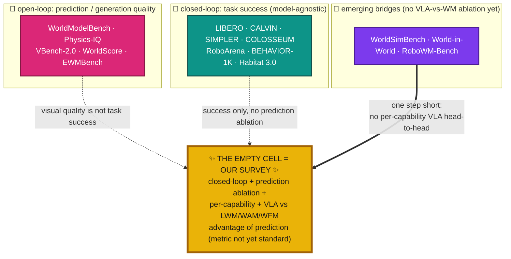
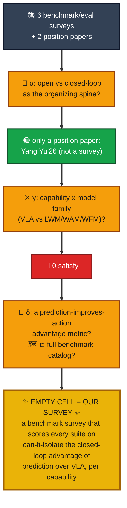

# 🧭📊 Novelty scan (framing B): a BENCHMARK / EVALUATION survey for "when world modeling helps a robot ACT"

🎯 **Topic:** a survey whose subject is the *benchmarks and evaluation methodology* 🧪 for **predictive embodied intelligence**: how the field measures whether predictive world models (latent 🧠 LWM / action-conditioned 🎬 WAM / generative 🌌 WFM) earn a **closed-loop behavioral advantage** 🔁 over direct **Vision-Language-Action (VLA)** policies ⚡, sliced by robotic capability. ACTION-ATLAS is the *benchmark* 🏋️; this survey maps the whole *evaluation landscape* around it. 🗺️

🔬 **Method:** 4 parallel research agents 🤖🤖🤖🤖 (manipulation/policy benchmarks 🦾 · nav/social/hidden-state benchmarks 🧭 · world-model eval benchmarks 🎥 · benchmark/evaluation *surveys* 📊), each web-verifying 🌐 every candidate against arXiv / venue / project pages. About 35 verified benchmark instances + 6 competitor surveys + 2 position papers. 📥 (Framing-A systems scan archived in `novelty_gap_A_systems.md`.)

## 📌 Gap statement (research language, paper-facing)

🎯 **Central research question:**
> *Across the robot-evaluation landscape, which benchmarks can actually establish that predictive world modeling produces a measurable, closed-loop behavioral advantage over direct Vision-Language-Action policies, and for which robotic capabilities?*

🕳️ **Why the field cannot answer this yet:**

| Regime | 🔬 How it is measured | 🚧 Why it can't answer "does prediction help acting" |
|---|---|---|
| 🎥 world models | open-loop: FVD, physics-consistency, rollout realism | ❌ no action, ❌ no VLA baseline |
| 🦾 policies + VLAs | closed-loop task success, but model-agnostic suites | ♻️ hosts any policy, ⚔️ never builds a WM-vs-VLA contrast |
| 🌉 bridges (World-in-World, RoboWM-Bench) | closed-loop, prediction to action | ⚠️ no per-capability VLA head-to-head |
| 🗣️ Yang Yu'26 (2606.15032) | position paper: open vs closed, decision utility | 📭 no benchmark catalog, 🚫 not a survey |
| ✨ the empty cell | joint α × β × γ × δ, delivered as ε | 🎯 = THIS survey |

🧭 **The organizing contribution (the 5-axis framework no survey uses):**

| Axis | 🔀 What it separates | 📉 Status in prior surveys |
|---|---|---|
| 🔭 **α: evaluation mode** | open-loop prediction quality vs closed-loop behavioral utility | 🚫 never the primary axis |
| 🧩 **β: robotic capability** | hidden-state / counterfactual / long-horizon / social | 🟡 only long-horizon recurs, 🔀 counterfactual ~untested |
| ⚔️ **γ: model family, one protocol** | direct VLA vs LWM / WAM / WFM head-to-head | ⬜ absent everywhere |
| 📐 **δ: behavioral-advantage instrument** | "does prediction beat a VLA baseline in the loop" | 🧪 proposed only (WAS, optimization-lift), not established |
| 🗺️ **ε: comprehensive benchmark catalog** | the full evaluation landscape mapped by α to δ | 📚 catalogs exist, but never crossed with γ, δ |

🏆 **In one sentence (the novelty claim):**
> The first **benchmark/evaluation survey of predictive embodied intelligence** organized by **evaluation-mode × robotic-capability × model-family**, showing (via a behavioral advantage-of-prediction lens) that current benchmarks *cannot yet establish when world modeling helps a robot act*, with counterfactual capability essentially unmeasured.

🔁 **How this mirrors P1 (`main_preprint.tex`):**

| Dimension | 📗 P1 "Weights or Skills?" | 📊 P3 (this survey) |
|---|---|---|
| 🧭 organizing axis nobody used | weights vs skills / *degree of self-improvement* | eval-mode × capability × family / *advantage of prediction* |
| 🗂️ subject catalogued | ~77 core + ~225 landscape systems | 🎯 target 150-300 benchmarks + eval works |
| 📦 deliverable | taxonomy + landscape + contrast tables | eval-methodology taxonomy + benchmark landscape + per-capability/per-family assessment |
| ⚖️ stance | assessed all camps | assesses ACTION-ATLAS/WAS, adopts nothing |

⚠️ **Honesty flag (survey voice, NOT position voice):**

| Rule | ✅ Do (survey) | 🚫 Don't (position) |
|---|---|---|
| 🔎 the gap | describe + assess it | argue it as a thesis |
| 🎯 "prediction must earn a closed-loop advantage" | report it as a *finding* | make it the paper's stance |
| 📚 what keeps P3 a survey | PRISMA + a 150-300 benchmark landscape | small corpus + advocacy |

## 📚 Competitor surveys found (6 surveys + 2 position papers)

### 📊 Benchmark / evaluation surveys (the direct competitors)
| # | Title | First author | Year | Venue | ID |
|--:|---|---|--:|---|---|
| 1 | 🥇 A Survey on Evaluation of Embodied AI | Liyu Hou (repo: EmbodiedAISurvey) | 2026 | Authorea (preprint) | 10.22541/au.176851544.45077723 |
| 2 | 📦 Vision-Language-Action in Robotics: A Survey of Datasets, Benchmarks, and Data Engines | Ziyao Wang | 2026 | 🏅 TMLR | 2604.23001 |
| 3 | 🏗️ Intelligent Automation for Embodied Benchmark Construction: Pipelines, Embodiments, Simulators, and Trends | Jinshan Lai | 2026 | arXiv | 2606.12207 |
| 4 | 🔁 A Survey on Reproducibility by Evaluating Deep RL Algorithms on Real-World Robots | Nicolai A. Lynnerup | 2020 | 🏅 CoRL (PMLR v100) | 1909.03772 |
| 5 | 🤖 World Model for Robot Learning: A Comprehensive Survey | Bohan Hou | 2026 | arXiv | 2605.00080 |
| 6 | ❓ A Survey of Embodied World Models | Yu Shang | 2026 | preprint (arXiv id ⚠️ unconfirmed) | -- |
| + | 🧪 A Survey of Embodied AI: From Simulators to Research Tasks (classic eval survey) | Jiafei Duan | 2022 | 🏅 IEEE TETCI | 2103.04918 |

### 🧭 Position / best-practices papers (verified, NOT surveys, the closest *concepts*)
| # | Title | First author | Year | Venue | ID |
|--:|---|---|--:|---|---|
| 7 | 🎯 How Should World Models Be Evaluated for Embodied Decision-Making? A Decision-Making-Centric Position | Yang Yu | 2026 | arXiv | 2606.15032 |
| 8 | 📐 Robot Learning as an Empirical Science: Best Practices for Policy Evaluation | Hadas Kress-Gazit | 2024 | arXiv (TRI) | 2409.09491 |

🔗 *Adjacent (world-model **method** surveys, archived in `novelty_gap_A_systems.md`): Xinqing Li 2510.16732, Fangyuan Wang 2606.00113, Zidan 2606.00133. Architecture-organized, none is a benchmark survey, none covers γ+δ+ε (audit-checked).*

## 🗺️ Benchmark landscape (the subject the survey maps, about 35 verified)

🔑 **Eval mode:** 🎥 open-loop (prediction/generation quality) · 🦾 closed-loop (task success) · 🌉 bridge (prediction converted to executed action). **Family:** most closed-loop suites are model-agnostic (score any policy), so a native VLA-vs-world-model contrast is rare.

| Benchmark | Year | ID | Capability | Eval mode | Native VLA-vs-WM contrast? |
|---|--:|---|---|:--:|:--:|
| 🦾 LIBERO | 2023 | 2306.03310 | short-horizon + transfer | 🦾 | ⬜ model-agnostic |
| 🦾 CALVIN | 2021 | 2112.03227 | long-horizon language | 🦾 | ⬜ |
| 🦾 SIMPLER / SimplerEnv | 2024 | 2405.05941 | generalization (real vs sim) | 🦾 | ⬜ |
| 🦾 THE COLOSSEUM | 2024 | 2402.08191 | generalization / robustness | 🦾 | ⬜ |
| 🦾 VLABench | 2025 | (proj) | long-horizon reasoning | 🦾 | ⬜ VLA-centric |
| 🦾 RoboArena | 2025 | 2506.18123 | real-world generalization | 🦾 | ⬜ ranking |
| 🦾 GemBench | 2024 | 2410.01345 | generalization levels | 🦾 | ⬜ |
| 🦾 RoboCasa | 2024 | 2406.02523 | long-horizon (data scaling) | 🦾 | ⬜ |
| 🦾 ManiSkill2 | 2023 | 2302.04659 | generalizable skills | 🦾 | ⬜ |
| 🦾 GenManip | 2025 | 2506.10966 | LLM-scene tasks | 🦾 | 🟡 modular-FM vs end-to-end |
| 🧭 Habitat 3.0 | 2023 | 2310.13724 | 👥 social / multi-agent | 🦾 | ⬜ |
| 🧭 BEHAVIOR-1K | 2024 | 2403.09227 | ⏳ long-horizon household | 🦾 | ⬜ |
| 🧭 ALFRED / ALFWorld | 2019/20 | 1912.01734 / 2010.03768 | ⏳ long-horizon, partial-obs | 🦾 | 🟡 abstract-vs-grounded |
| 🧭 TEACh | 2021 | 2110.00534 | 👁️ hidden-state (dialog) | 🦾 | ⬜ |
| 🧭 LIBERO-Mem | 2025 | 2511.11478 | 👁️ hidden-state / occlusion | 🦾 | ✅ memory vs Markovian/VLA |
| 🧭 O-PIAAGETS | 2022 | (CEUR Vol-3169) | 👁️ object permanence | 🦾 | 🟡 capability probe |
| 🧭 SocNavBench | 2021 | 2103.00047 | 👥 social navigation | 🦾 | ⬜ |
| 🧭 RoboTHOR | 2020 | 2004.06799 | navigation / sim-to-real | 🦾 | ⬜ |
| 🎥 WorldModelBench | 2025 | 2502.20694 | video-WM prediction quality | 🎥 | ⬜ WM-only |
| 🎥 Physics-IQ | 2025 | 2501.09038 | physical realism | 🎥 | ⬜ WM-only |
| 🎥 VBench-2.0 | 2025 | 2503.21755 | generation faithfulness | 🎥 | ⬜ WM-only |
| 🎥 WorldScore | 2025 | 2504.00983 | world-gen quality | 🎥 | ⬜ WM-only |
| 🎥 EVA-Bench | 2024 | 2410.15461 | embodied video anticipation | 🎥 | ⬜ WM-only |
| 🎥 EWMBench | 2025 | 2505.09694 | scene/motion/semantic quality | 🎥 | ⬜ WM-only |
| 🎥 WorldPrediction | 2025 | 2506.04363 | 🔀 counterfactual action recognition | 🎥 | ⬜ discriminative probe |
| 🌉 WorldSimBench | 2024 | 2410.18072 | video-to-action consistency | 🌉 | 🟡 simulator action-translatability |
| 🌉 World-in-World | 2025 | 2510.18135 | closed-loop task success of WMs | 🦾 | 🟡 WM as policy substrate |
| 🌉 RoboWM-Bench | 2026 | 2604.19092 | prediction executability | 🌉 | 🟡 WM executability, no VLA pole |
| 🌉 WorldArena | 2026 | 2602.08971 | closed-loop WM arena | 🦾 | 🟡 WM arena, no VLA pole |

📌 **Reading:** 🦾 policy benchmarks measure *task success* (model-agnostic, so both a VLA and a world-model policy CAN run, but none builds the contrast); 🎥 world-model benchmarks measure *generation quality* (no action); 🌉 only **WorldSimBench / World-in-World / RoboWM-Bench** bridge to action, and **World-in-World reports visual quality is not task success**, yet none runs a per-capability VLA-vs-LWM/WAM/WFM ablation. 🔀 **Counterfactual** is barely testable anywhere (only WorldPrediction, and only as offline recognition).

## 📊 Coverage matrix (surveys x evaluation axes)

🔑 **Legend:** ✅ = `covered` (organizing spine) · 🟡 = `partial` (touched in a subsection) · ⬜ = `absent`.

| Organizing axis \ Survey | 🥇 Hou-eval (Authorea) | 📦 Z.Wang'26 (2604.23001) | 🏗️ Lai'26 (2606.12207) | 🔁 Lynnerup'20 (1909.03772) | 🤖 B.Hou'26 (2605.00080) | ❓ Shang'26 (no id) | 🎯 Yang Yu'26 (2606.15032, position) | 🧪 Duan'22 (2103.04918) |
|---|:--:|:--:|:--:|:--:|:--:|:--:|:--:|:--:|
| **🔭 α. Open-loop vs closed-loop as the PRIMARY axis** | 🟡 | ⬜ | ⬜ | ⬜ | 🟡 | 🟡 | ✅ | 🟡 |
| **🧩 β. Capability cuts** (hidden-state / counterfactual / long-horizon / social) | 🟡 | ⬜ | 🟡 | ⬜ | ⬜ | ⬜ | 🟡 | 🟡 |
| **⚔️ γ. Capability x model-family cross-tab** (VLA vs LWM/WAM/WFM under one protocol) | ⬜ | ⬜ | ⬜ | ⬜ | 🟡 | 🟡 | ⬜ | ⬜ |
| **📐 δ. Behavioral-advantage metric** ("does prediction improve closed-loop action"; proposed but NOT established: ACTION-ATLAS's WAS, Yang Yu's optimization-lift) | ⬜ | ⬜ | ⬜ | ⬜ | 🟡 | ⬜ | ✅ | ⬜ |
| **🗺️ ε. Comprehensive benchmark landscape catalog** | ✅ | ✅ | ✅ | ⬜ | 🟡 | 🟡 | ⬜ | ✅ |

🔎 **Row readings:** axis **⚔️ γ** has **no ✅ anywhere**, and axis **📐 δ** is owned only by the 🎯 Yang Yu'26 **position paper** (never by a *survey*). The catalog surveys (🥇📦🏗️🧪) own **🗺️ ε** but skip **γ** and **δ**. Yang Yu'26 owns **🔭 α** and **📐 δ** but is a **position paper**, not a survey, with **no benchmark catalog** (ε ⬜) and no capability x family cross-tab (γ ⬜). 🤖 B.Hou'26 touches γ/δ but only in an eval subsection and is not capability-organized (β ⬜).

## 🎨 Visualizing the novelty

**1. 🔭 The evaluation split** (where every benchmark sits, and the missing bridge):

**2. 🕳️ The novelty funnel** (how the competitor surveys drain to the empty cell):

## 🕳️ The gap

🚫 **No survey maps the robot-eval landscape by whether a benchmark can isolate the closed-loop advantage of prediction (LWM/WAM/WFM) over direct VLA policies, per capability.** The three tables below show why.

**① Benchmarks: three buckets, none isolates the advantage** 🏋️

| Bucket | Examples | Eval mode | Missing leg |
|---|---|:--:|---|
| 🦾 policy suites | LIBERO, CALVIN, SIMPLER, COLOSSEUM, RoboArena, BEHAVIOR-1K, Habitat 3.0 | closed-loop | model-agnostic: *hosts* but never *builds* a VLA-vs-WM contrast |
| 🎥 world-model suites | WorldModelBench, Physics-IQ, VBench-2.0, WorldScore, EWMBench | open-loop | generation quality only, no action, no VLA baseline |
| 🌉 bridges | WorldSimBench, World-in-World, RoboWM-Bench | mixed | reach action (World-in-World: "visual quality is not task success"), but no per-capability VLA-vs-WM ablation |

**② Surveys: the closest works and the leg each misses** 📚

| Work | Type | Owns | Misses |
|---|---|---|---|
| 🥇 Hou-eval (Authorea) | eval survey | ε catalog, β partial | γ, δ (model-agnostic, no advantage metric) |
| 📦🏗️🧪 Z.Wang / Lai / Duan | dataset/benchmark surveys | ε catalog | γ, δ, capability cuts |
| 🤖 B.Hou'26 (2605.00080) | WM *method* survey | γ/δ partial | not capability-organized, not a benchmark survey |
| 🎯 Yang Yu'26 (2606.15032) | **position paper** | α, δ | ε (no catalog), γ |

✨ **Empty cell = α ∧ β ∧ γ ∧ δ, delivered as ε.** Populatable by ~35 real benchmarks; ACTION-ATLAS is one recent instance 🏋️. 🔀 *Counterfactual* evaluation is nearly untested anywhere (bonus gap).

**③ The advantage metric is proposed, NOT established** (so the survey *assesses*, does not *adopt*)

| Proposed metric | By | Venue | Established? | What it is |
|---|---|---|:--:|---|
| World Advantage Score (WAS) | ACTION-ATLAS (Das) | preprint | ❌ | normalized gain over a VLA baseline |
| optimization lift / policy-ranking agreement | Yang Yu'26 | position paper (2606.15032) | ❌ | same idea, different name |

🎯 NOVELTY CONFIRMED: evaluation-mode x capability x model-family for predictive embodied intelligence -- a benchmark/evaluation survey that scores whether each robot benchmark can isolate the closed-loop advantage of prediction (LWM/WAM/WFM) over direct VLA policies, per capability (hidden-state / counterfactual / long-horizon / social), using a behavioral advantage-of-prediction lens that current proposals (WAS, optimization-lift) only partially formalize. ✅

## 🛡️ Audit

🕵️ Adversarial audit (fresh agent, default-REFUTED stance, saw only this file). Three attacks:
- 🔎 **(a) Hallucination check:** ✅ every load-bearing ID resolves to the claimed paper. Surveys: Ziyao Wang 2604.23001, Lai 2606.12207, Yang Yu 2606.15032, Kress-Gazit 2409.09491, B.Hou 2605.00080, Duan 2103.04918, Lynnerup 1909.03772. Benchmarks: World-in-World 2510.18135, RoboWM-Bench 2604.19092 (Feng Jiang), WorldSimBench 2410.18072, WorldModelBench 2502.20694, LIBERO-Mem 2511.11478, GenManip 2506.10966, RoboArena 2506.18123. The 2 self-flagged items (Hou-eval Authorea, Shang) confirmed via independent indices. 0️⃣ fabrications.
- 🕳️ **(b) Gap-fill:** no single survey covers γ+δ+ε. The auditor surfaced extra world-model **method** surveys not in the scan (2510.16732, 2606.00113, 2606.00133) and the WorldArena benchmark (2602.08971); each was checked, none fills the cell (they are architecture-organized or benchmarks, not capability x family evaluation surveys with an advantage metric).
- 📊 **(c) Matrix spot-check:** marks on the 3 closest columns defensible; only Yang Yu's δ was mildly understated.

🔧 Fixes applied after the audit: Yang Yu'26 δ corrected 🟡 -> ✅ (row-reading reworded so δ is credited to that **position paper**, never to a survey); WorldArena (2602.08971) added to the landscape; the adjacent world-model method surveys noted; LIBERO-Mem clarified as the memory benchmark from Chung (2511.11478). None of these touches the empty cell: **γ (capability x family) and δ (advantage metric) are unoccupied by any survey**, so the gap holds.

🏆 AUDIT VERDICT: ACHIEVED ✅
