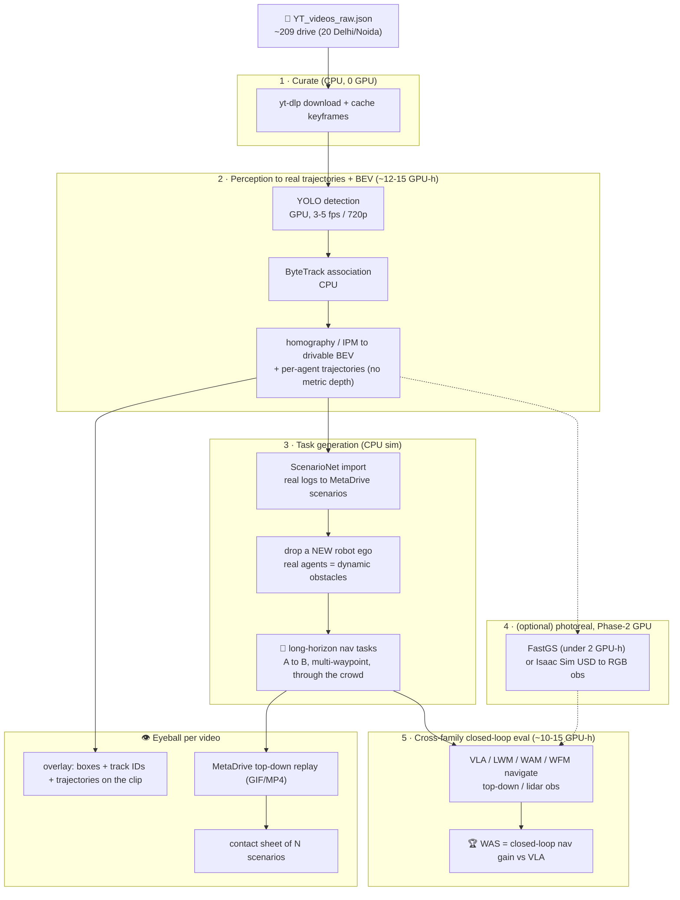

# 📦 ACTION-ATLAS: Robot Datasets & Sims

🎯 Zero-shot (no-training) robotic-execution: 3 frozen families on one DROID/Franka arm, transparent/clutter observation-OOD. WFM cannot act zero-shot (video-only, [WorldBench](https://world-bench.github.io/)) so it is 3 families not 4; DenseWorld nav is a training-heavy Phase-3. Full risk analysis: `plan_rejections_risks.md`.

## 🎓 Why we diverge from the proposal (`v0_proposal/p2_ACTION_ATLAS_ARXIV.md`) - one-glance for the professor

| 🔀 | 📄 Proposal (ACTION-ATLAS / DenseWorld) said | 🔍 What the novelty-hunt + feasibility audit found (ELI5) | ✅ What we do instead |
|---|---|---|---|
| 1️⃣ | 🌌 Compare **4 families** incl. WFM (Cosmos) | WFM only *makes videos* - it cannot move a robot with no training | ⚡🧠🎬 **3 families** that actually act |
| 2️⃣ | 🗺️ **DenseWorld** = drive through crowds is the *core novelty* | **No model can drive zero-shot** - needs training + a heavy 3D street rebuild | ❌ Drop driving; move the "surprise the robot" idea to a **robot arm** |
| 3️⃣ | 📏 **WAS** metric + **γ 4-family matrix** = our contribution | **Already published** (World-in-World, WorldArena, V-JEPA-2-AC) - not new | 🙏 Reuse + credit them; do not claim it as novel |
| 4️⃣ | 🔮🕰️👥 Four capability domains via off-HF sims (CARLA / Habitat) | Each needs a **different robot body + training** = months, breaks zero-shot | ✂️ Cut to the **one arm** the models already know: **DROID/Franka** (not SIMPLER, which is VLA-only) |
| 5️⃣ | 🧵🔨🧑 Hard new physics (deformable, contact, handover) as tasks | Those live on **other robot bodies** - a frozen model cannot act on them | ❌ Drop; change **only what the camera sees** (transparent / clutter) |
| 6️⃣ | 🔟 Score all **10 metrics** (incl. prediction + confidence) | A plain VLA outputs **only moves** - no prediction/confidence to score | 4️⃣ Keep only the **"did it work?"** behavioural scores |
| 7️⃣ | 🧠 Treats **I-JEPA, V-JEPA, V-JEPA2, MC-JEPA** as runnable policies | They are **encoders (no action output)** - cannot drive a robot as-is | 🔌 Add a **training-free interface layer** (encoder-as-cost MPC · cross-embodiment adapter · planner+PID) -> lifts **3 native -> 11 feasible** |
| 8️⃣ | 👻 Roster names **Helix, H-JEPA, Fast-WAM, τ₀-WM** | **No open weights, no paid API, no release** - unrunnable by anyone (verified 2026-08-13) | 🚫 Keep listed but **footnote EXCLUDED**; feasible set = **11 of 15** |
| ✅ | *(everything above converges to...)* | one small, honest, feasible test | 🤖 **DROID/Franka arm + glass/clutter OOD + 11-of-15 zero-shot models (3 native) + behavioural ΔWAS** |

## 📚 Design, models, datasets, build and references (all detail in one table)

| 🗂️ Aspect | 📄 Detail (with links) |
|---|---|
| 🎯 Converged design | on **DROID/Franka**, hand 3 frozen models a transparent/clutter pick-and-place and measure if the world-model success edge survives; curate by changing **only what the camera sees** (glass/steel or clutter), robot+physics+controls untouched; ship datasheet + Croissant on HF; GPU-light (inference only). |
| 📏 Metrics | 🟢 **TSR / LHCR / RSR / SPR** (did it work? from the robot outcome) = ✅ computable for all 3 families · 🔴 **HSLA / CSA / FRE / ACPE** (prediction) + **ECE / RCS** (confidence) = ❌ not for a plain VLA. `WAS = (success_wm - success_VLA)/(success_VLA + ε)` on the green row; headline **ΔWAS = WAS(surprise) - WAS(normal)** = did the edge survive? |
| 🧊 Curate-from (perception-only / wrong-body) | just-pictures: [ClearGrasp](https://github.com/Shreeyak/cleargrasp) · [GraspNet-1B](https://dl.acm.org/doi/abs/10.1177/02783649231193710) · [MetaGraspNet](https://dl.acm.org/doi/10.1109/CASE49997.2022.9926427); wrong-body sims a frozen model cannot drive: [SoftGym](https://github.com/Xingyu-Lin/softgym) · [DaXBench](https://daxbench.github.io/) · [HandoverSim](https://arxiv.org/abs/2205.09747) · [ManiSkill](https://arxiv.org/pdf/2508.17449). |
| ⚡ Model - π0/π0.5 ([π0-FAST](https://github.com/Physical-Intelligence/openpi/blob/main/examples/droid/README.md)) | runnable ✅, actions ✅, zero-shot ✅ (DROID ckpt), native actions, words -> ✅ **FEASIBLE (native)** |
| ⚡ Model - OpenVLA | ✅ / ✅, ❌ WidowX-native; path = cross-embodiment ([Mirage](https://arxiv.org/pdf/2402.19249) / [Cloak](https://arxiv.org/pdf/2606.22836)) or native WidowX, words -> 🟡 via adapter |
| ⚡ Model - Octo | ✅ / ✅, ❌ WidowX/Bridge-native; path = cross-embodiment or native WidowX, words -> 🟡 via adapter |
| ⚡ Model - GR00T N1/N1.5 | ✅ / ✅, ❌ humanoid; path = native humanoid split or cross-embodiment adapter, words -> 🟡 via adapter |
| ⚡ Model - Gemini Robotics | API planner (no exec ckpt); path = planner -> scripted PID / pure-pursuit controller, words -> ✅ planner+controller |
| ⚡ Model - Helix (Figure) | proprietary, no public ckpt (substitute [OpenHelix](https://github.com/OpenHelix-Team/OpenHelix)) -> ⛔ EXCLUDED |
| 🧠 Model - [V-JEPA-2-AC](https://arxiv.org/abs/2506.09985) | runnable ✅, actions ✅ (image-goal MPC), zero-shot ✅ (Franka, goal-image), goal photo -> ✅ **FEASIBLE (native)** |
| 🧠 Model - I-JEPA / V-JEPA / V-JEPA2 / MC-JEPA | encoders, no action output ❌; path = frozen-encoder-as-cost random-shooting MPC over the benchmark's own sim, goal image -> ✅ via encoder-as-cost |
| 🧠 Model - H-JEPA | concept, no ckpt (fabricated, risk #7) -> ⛔ EXCLUDED |
| 🎬 Model - [DreamZero](https://arxiv.org/html/2602.15922v1) | runnable ✅, actions ✅, zero-shot ✅ (native Franka/DROID), words/verb -> ✅ **FEASIBLE (native)** |
| 🎬 Model - UVA | ✅ / ✅, ❌ own-embodiment only; path = native or cross-embodiment adapter, words -> 🟡 via adapter |
| 🎬 Model - Fast-WAM / τ₀-WM (arXiv 2606.01027) | no public ckpt / unverified -> ⛔ EXCLUDED |
| 🧮 Feasible set | **3 native** (π0/π0.5, V-JEPA-2-AC, DreamZero) -> **11 of 15** with the training-free paths (10 open-weights + Gemini Robotics API); the 4 with no ckpt (Helix, H-JEPA, Fast-WAM, τ₀-WM) are the only irreducible exclusions. Adapters make models *runnable*, NOT equally strong - that spread IS the experiment (Mirage/Cloak are inference-time, no training). |
| ⚠️ Honest ceilings | answers only the weak "does the edge survive glass/clutter?"; V-JEPA-2-AC takes a goal image vs π0/DreamZero language (+ size 14B vs ~3B) = a WAS confound partly differenced by ΔWAS; on the *normal* split π0-FAST/DreamZero are in-distribution so "zero-shot" = no fine-tuning by us, the genuinely novel test is the OOD split. |
| 📦 Dataset - [LIBERO](https://huggingface.co/datasets/lerobot/libero) `lerobot/libero` | 🟢 the one HF robot sim Gemini-ER2 drives closed-loop (Phase 1); ~6,500 demos, 130 tasks; occlusion (LIBERO-Mem) + long-horizon (LIBERO-Long); con: sim-only |
| 📦 Dataset - [AgiBot World Beta](https://huggingface.co/datasets/agibot-world/AgiBotWorld-Beta) `agibot-world/AgiBotWorld-Beta` | 🟢 1M+ real dual-arm, 217 tasks, tactile, multi-robot (partial ION); con: offline (Phase 2) |
| 📦 Dataset - [Open X-Embodiment](https://huggingface.co/datasets/jxu124/OpenX-Embodiment) `jxu124/OpenX-Embodiment` | 🟡 largest cross-embodiment corpus (1M+, 22 embodiments); con: offline, generic manip |
| 📦 Dataset - [DROID](https://huggingface.co/datasets/cadene/droid) `cadene/droid` | 🟡 76k real in-the-wild episodes (92,223), RGB+depth; con: offline, manip-only |
| 📦 Dataset - [RoboMIND](https://huggingface.co/datasets/x-humanoid-robomind/RoboMIND) `x-humanoid-robomind/RoboMIND` | 🟡 107k real multi-embodiment (310k in v2.0); con: offline, gated |
| 📦 Dataset - [BridgeData V2](https://huggingface.co/datasets/nvidia/BridgeData2_LeRobot_v3) `nvidia/BridgeData2_LeRobot_v3` | 🟡 60k real, language-conditioned; con: tabletop-only, offline |
| 🚧 No-HF-sim (off-HF, Phase 2) | 🔮 counterfactual: CARLA / MetaDrive / nuScenes · 👥 social: Habitat 3.0 / [JRDB](https://arxiv.org/abs/1910.11792) / JRDB-Social / CrowdNav / SocNavBench · or the own-built DenseWorld |
| ✅ Recommended core set | run the 3 families closed-loop on **DROID/Franka** (SIMPLER is WidowX/Google-robot = VLA-only, cannot host the cross-family comparison; LIBERO = Phase-1 harness check only); reuse public data, no training, report WAS crediting priors. Phase-2+ reference (retired): LIBERO + AgiBot + OXE + DROID + RoboMIND + Bridge + off-HF sims |
| ⚖️ Build own dataset - PROS | 🆕 restores novelty (untested γ cells under one protocol) · 🎯 capability isolation · ⚔️ cross-family fairness · 🗃️ artifact control (datasheet + Croissant) · 🤖 real-robot slice (CoRL/RSS) |
| ⚖️ Build own dataset - CONS + verdict | 💰 cost/time · 🧪 construct-validity · ⏳ scooping risk · ⚖️ ethics/IRB (social data) · 🧾 soundness burden. Recommended: do NOT re-collect or bank on DenseWorld for novelty - the protocol is already published ([V-JEPA-2-AC](https://arxiv.org/abs/2506.09985), [WorldArena](https://arxiv.org/abs/2602.08971)) |
| 🗺️ DenseWorld pipeline (⛔ Phase-3, NOT zero-shot) | ~209 drive videos (`YT_videos_raw.json`) -> closed-loop nav via MetaDrive/ScenarioNet on CPU seeded with real trajectories (~30 GPU-h on one 4090); no family drives zero-shot (needs trained nav head + photoreal). Eyeball per clip: detection+track overlay, MetaDrive top-down replay, contact sheet. Diagram below. |
| 🛠️ NVIDIA scale-up stack (Phase-2, GPU-heavy) | [Isaac Sim](https://developer.nvidia.com/isaac/sim) (photoreal OOD USD scenes) · [Isaac Lab](https://github.com/isaac-sim/IsaacLab) (GPU closed-loop harness, 16+ robots) · [GR00T-Mimic](https://build.nvidia.com/nvidia/isaac-gr00t-synthetic-manipulation) (few demos -> 780k synthetic in 11 h; makes manipulation not nav) · [cosmos-curator](https://github.com/NVIDIA/cosmos-curator) (curation) · [cosmos-evaluator](https://github.com/NVIDIA/cosmos-evaluator) (auto-eval -> FRE/ACPE) |

## 🗺️ DenseWorld generation pipeline (Phase-3 reference diagram)

## 🔗 Sources
- HF datasets: [Open X-Embodiment](https://huggingface.co/datasets/jxu124/OpenX-Embodiment) · [DROID](https://huggingface.co/datasets/cadene/droid) · [BridgeData V2](https://huggingface.co/datasets/nvidia/BridgeData2_LeRobot_v3) · [AgiBot World Beta](https://huggingface.co/datasets/agibot-world/AgiBotWorld-Beta) · [RoboMIND](https://huggingface.co/datasets/x-humanoid-robomind/RoboMIND) · [LIBERO](https://huggingface.co/datasets/lerobot/libero)
