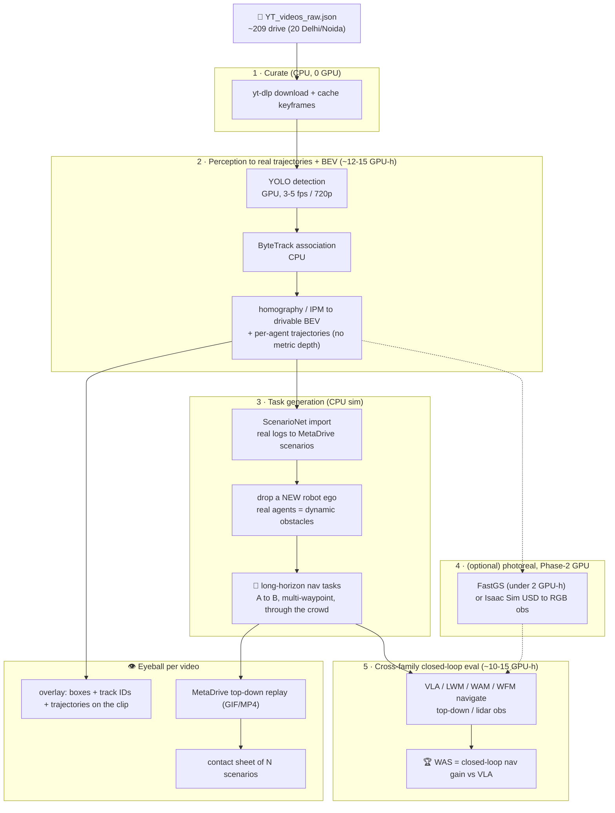

# 📦 ACTION-ATLAS: Robot Datasets & Sims

> 🎯 **FOCUS: Benchmarking Zero-shot (No training) ROBOTIC EXECUTION ONLY.** ACTION-ATLAS is a robot closed-loop benchmark, so its data are robot datasets/sims, not video-QA.
>
> ⛔ **REALITY CORRECTION (2026-08-12, see `plan_rejections_risks.md`).** Stripped to zero-shot no-training, the original ACTION-ATLAS / DenseWorld plan does not hold: 🌌 **WFM (Cosmos) cannot act zero-shot** (video-only, [WorldBench](https://world-bench.github.io/)) so it is **3 families** not 4; 🗺️ **DenseWorld driving-nav is NOT zero-shot** (no family drives without a trained nav head + photoreal recon), retired to the Phase-3 reference below. The **converged feasible design** runs the 3 frozen families on **one shared DROID/Franka arm** with **observation-space OOD** (transparent / clutter). The diversion table gives the one-glance "why".

## 🎓 Why we diverge from the proposal (`v0_proposal/p2_ACTION_ATLAS_ARXIV.md`) - one-glance answer for the professor

| 🔀 | 📄 Proposal (ACTION-ATLAS / DenseWorld) said | 🔍 What the novelty-hunt + feasibility audit found (ELI5) | ✅ What we do instead |
|---|---|---|---|
| 1️⃣ | 🌌 Compare **4 families** incl. WFM (Cosmos) | WFM only *makes videos* - it cannot move a robot with no training | ⚡🧠🎬 **3 families** that actually act |
| 2️⃣ | 🗺️ **DenseWorld** = drive through crowds is the *core novelty* | **No model can drive zero-shot** - needs training + a heavy 3D street rebuild | ❌ Drop driving; move the "surprise the robot" idea to a **robot arm** |
| 3️⃣ | 📏 **WAS** metric + **γ 4-family matrix** = our contribution | **Already published** (World-in-World, WorldArena, V-JEPA-2-AC) - not new | 🙏 Reuse + credit them; do not claim it as novel |
| 4️⃣ | 🔮🕰️👥 Four capability domains via off-HF sims (CARLA / Habitat) | Each needs a **different robot body + training** = months, breaks zero-shot | ✂️ Cut to the **one arm** the models already know: **DROID/Franka** (not SIMPLER, which is VLA-only) |
| 5️⃣ | 🧵🔨🧑 Hard new physics (deformable, contact, handover) as tasks | Those live on **other robot bodies** - a frozen model cannot act on them | ❌ Drop; change **only what the camera sees** (transparent / clutter) |
| 6️⃣ | 🔟 Score all **10 metrics** (incl. prediction + confidence) | A plain VLA outputs **only moves** - no prediction/confidence to score | 4️⃣ Keep only the **"did it work?"** behavioural scores |
| 7️⃣ | 🧠 Treats **I-JEPA, V-JEPA, V-JEPA2, MC-JEPA** as runnable policies | They are **encoders (no action output)** - cannot drive a robot as-is | 🔌 Add a **training-free interface layer** (encoder-as-cost MPC · cross-embodiment adapter · planner+PID) → lifts **3 native → 11 feasible** |
| 8️⃣ | 👻 Roster names **Helix, H-JEPA, Fast-WAM, τ₀-WM** | **No open weights, no paid API, no release** (proprietary / concept / unreleased) - unrunnable by anyone (verified 2026-08-13) | 🚫 Keep listed but **footnote EXCLUDED**; feasible set = **11 of 15** |
| ✅ | *(everything above converges to...)* | one small, honest, feasible test | 🤖 **DROID/Franka arm + glass/clutter OOD + 11-of-15 zero-shot models (3 native) + behavioural ΔWAS** |

## ✅ Converged near-term design (feasible, zero-shot, no training)

> 🎯 **One line:** on the **DROID/Franka** arm, hand 3 frozen models a **transparent-object or clutter** version of an ordinary pick-and-place, and measure **whether the world-model's success-rate edge survives** the surprise.

**🗂️ Task 1 - datasets (ELI5):** no ready-made set fits - they are either *just pictures* ([ClearGrasp](https://github.com/Shreeyak/cleargrasp), [GraspNet-1B](https://dl.acm.org/doi/abs/10.1177/02783649231193710), [MetaGraspNet](https://dl.acm.org/doi/10.1109/CASE49997.2022.9926427) = perception-only, no robot playing) or built for a *different robot body* ([SoftGym](https://github.com/Xingyu-Lin/softgym), [DaXBench](https://daxbench.github.io/), [HandoverSim](https://arxiv.org/abs/2205.09747), [ManiSkill](https://arxiv.org/pdf/2508.17449)) a frozen model cannot drive.

**🛠️ Task 1.2 - how to curate (this file's HF + Croissant ethos):** take the **DROID/Franka** setup the models already know and change **only what the camera sees** - swap objects to glass/steel (transparent) or pile on clutter/occlusion - leaving robot + physics + controls untouched (the only edit that stays zero-shot). Ship a **datasheet + Croissant** on HF; GPU-light (inference only, no training).

**📏 Task 2 - the 10 metrics (ELI5):**

| 📏 Metric group | 🤖 Zero-shot computable? | 🔍 Why (ELI5) |
|---|---|---|
| 🟢 **TSR / LHCR / RSR / SPR** ("did it work?") | ✅ all 3 families | come from the **robot's outcome**, not the model's insides |
| 🔴 HSLA / CSA / FRE / ACPE (prediction) | ❌ not for VLA | a plain VLA outputs **only moves**, no predicted picture to score |
| 🔴 ECE / RCS (confidence) | ❌ not for VLA | a VLA gives **no calibrated confidence** number |

➡️ **WAS** is well-defined **only** on the green row: `WAS = (success_worldmodel - success_VLA) / (success_VLA + ε)`; the headline is **ΔWAS = WAS(surprise) - WAS(normal)** = *did the edge survive?*

**🤖 Task 3 - zero-shot execution (ELI5):** put all three on the **same Franka/DROID arm**, hand each its **native instruction**, no training:

| 🧬 Family | 🧊 Frozen model (verified) | 🗣️ Native instruction |
|---|---|---|
| ⚡ VLA | [π0-FAST](https://github.com/Physical-Intelligence/openpi/blob/main/examples/droid/README.md) (trained on DROID) | words |
| 🧠 LWM | [V-JEPA-2-AC](https://arxiv.org/abs/2506.09985) (Franka, image-goal MPC) | a goal photo |
| 🎬 WAM | [DreamZero](https://arxiv.org/html/2602.15922v1) (native Franka/DROID) | words / verb |

⚠️ **Honest ceiling (put it in the paper):** this answers only the **weak** question ("does the success-rate edge survive glass/clutter?"), **not** a prediction-quality or confidence advantage (those do not exist for a VLA); and any gap is **confounded by model size** (DreamZero 14B vs π0 ~3B) + instruction type - caveat it, do not claim a clean architecture win.

## 🧪 Per-model zero-shot feasibility on the novel dataset (15 models, audited 2026-08-12)

> ✅ **Goal resolved (2026-08-13): keep all 15 on the roster; bar = "each model with a paid API OR open weights for zero-shot inference".** On the novel dataset every *released* model is feasible - **3 natively** (π0/π0.5, V-JEPA-2-AC, DreamZero), **11 of 15** once the training-free interface layer below is added (10 open-weights + Gemini Robotics via `gemini-robotics-er-2-preview` API). The **4 with NEITHER open weights NOR a paid API** stay listed but are **EXCLUDED** (verified 2026-08-13): 🚫 **Helix** = Figure AI proprietary, onboard-only, no endpoint · 🚫 **H-JEPA** = LeCun concept, no model exists · 🚫 **Fast-WAM** = no release found · 🚫 **τ₀-WM** = AgiBot research paper (arXiv 2606.01027, Pengfei Zhou et al.), no public weights/code/API found. You cannot run what was never released (risk-row #7). Native-only feasibility (no interface layer) = 3.

| 🧬 Family | Model | ▶️ Runnable ckpt? | 🤖 Emits actions? | 🎯 Zero-shot on shared DROID/Franka? | Verdict |
|---|---|---|---|---|---|
| ⚡ VLA | **π0 / π0.5** | ✅ | ✅ | ✅ (DROID ckpt) | ✅ **FEASIBLE** |
| ⚡ VLA | OpenVLA | ✅ | ✅ | ❌ WidowX-native | 🟡 WidowX only / needs Franka FT |
| ⚡ VLA | Octo | ✅ | ✅ | ❌ WidowX/Bridge-native | 🟡 WidowX only / needs Franka FT |
| ⚡ VLA | GR00T N1/N1.5 | ✅ | ✅ | ❌ humanoid, new arm needs post-train | 🟡 NEEDS-TRAINING |
| ⚡ VLA | Gemini Robotics | ❌ API planner | ❌ (planner) | ❌ | ⛔ NO open exec ckpt |
| ⚡ VLA | Helix (Figure) | ❌ proprietary | - | ❌ | ⛔ NO-CHECKPOINT (OpenHelix ≠ Helix) |
| 🧠 LWM | **V-JEPA-2-AC** | ✅ | ✅ (image-goal MPC) | ✅ (Franka, goal-image) | ✅ **FEASIBLE\*** |
| 🧠 LWM | I-JEPA | ✅ (encoder) | ❌ | ❌ | ⛔ ENCODER, cannot act |
| 🧠 LWM | V-JEPA / V-JEPA2 | ✅ (encoder) | ❌ | ❌ | ⛔ ENCODER, cannot act |
| 🧠 LWM | MC-JEPA | ✅ (encoder) | ❌ | ❌ | ⛔ ENCODER, cannot act |
| 🧠 LWM | H-JEPA | ❌ concept | - | ❌ | ⛔ NO-CHECKPOINT (fabricated, risk #7) |
| 🎬 WAM | **DreamZero** | ✅ | ✅ | ✅ (native Franka/DROID) | ✅ **FEASIBLE** |
| 🎬 WAM | UVA | ✅ | ✅ | ❌ own-embodiment only | 🟡 NEEDS-TRAINING |
| 🎬 WAM | Fast-WAM | ❌ | - | ❌ | ⛔ NO-CHECKPOINT (fabricated, risk #7) |
| 🎬 WAM | τ₀-WM | ❓ arXiv 2606.01027 only | ❓ | ❓ | ⛔ UNVERIFIED, keep OUT |

**✅ Feasible cross-family zero-shot set = {π0/π0.5, V-JEPA-2-AC, DreamZero}** (one per family) on the **novel dataset = DROID/Franka transparent + dense-clutter observation-OOD split** (inference-only, GPU-light). *A WidowX substrate adds OpenVLA + Octo but is VLA-only, so the cross-family comparison lives only on DROID/Franka.*

⚠️ **Two honest asterisks:** (1) \* V-JEPA-2-AC takes a **goal image**, π0/DreamZero take **language** (+ size gap 14B vs ~3B) = a WAS fairness confound, partly differenced-out by **ΔWAS = WAS(OOD) - WAS(normal)**. (2) On the *normal* split π0-FAST-DROID + DreamZero are **in-distribution** (trained on DROID), so here "zero-shot" means **no fine-tuning by us**; the genuinely novel test is the **OOD (glass/clutter) split**. 🚫 Anti-fabrication: H-JEPA, Fast-WAM, Helix, τ₀-WM stay OUT (no runnable checkpoint).

## 🔌 Training-free interface layer - making EVERY released model feasible zero-shot

> The "only 3" verdict above is for **native** use. A benchmark can add **inference-time adapters** (no model weights trained) that give each model TYPE a training-free path to robotic execution. This lifts feasibility from 3 to **11 of 15** - every model that has a public checkpoint. The other 4 have no runnable weights and cannot be included by anyone.

| 🧬 Model(s) | 🔌 Training-free execution path (no weights trained) | ✅ Feasible? |
|---|---|---|
| π0/π0.5, DreamZero | **native actions** on DROID/Franka | ✅ direct |
| V-JEPA-2-AC | **image-goal MPC** on Franka | ✅ direct |
| OpenVLA, Octo | run on Franka via **inference-time cross-embodiment** ([Mirage](https://arxiv.org/pdf/2402.19249) cross-painting / [Cloak](https://arxiv.org/pdf/2606.22836) EE-masking), or on their native WidowX arm (multi-embodiment split) | ✅ via adapter |
| GR00T | on its native **humanoid** embodiment (humanoid tabletop split) or cross-embodiment adapter | ✅ via adapter |
| UVA | on its native embodiment; cross-embodiment adapter for the shared arm | ✅ via adapter |
| Gemini Robotics | API **planner → scripted PID / pure-pursuit controller** closes the loop | ✅ planner+controller |
| I-JEPA, V-JEPA, V-JEPA2, MC-JEPA | **frozen encoder as a perceptual COST** in sampling-based (random-shooting) MPC over the benchmark's OWN sim: execute candidate actions in sim, pick the one whose result-frame latent is closest to the goal-image latent (encoder never trained) | ✅ encoder-as-cost |
| Helix, H-JEPA, Fast-WAM, τ₀-WM | **NO public checkpoint exists** - cannot be run by anyone (substitute [OpenHelix](https://github.com/OpenHelix-Team/OpenHelix) for Helix, otherwise EXCLUDE) | ⛔ irreducible |

**Net: 11 of 15 released models feasible zero-shot** on the novel dataset via a no-training interface layer; the 4 unreleased/concept models (Helix, H-JEPA, Fast-WAM, τ₀-WM) are the only irreducible exclusions.

⚠️ **Honesty on the interface layer:** these adapters make each model *runnable* zero-shot (the goal's bar = "feasible for robotic execution"), NOT equally strong - an encoder-as-cost MPC or a cross-embodiment-painted VLA will usually score far below a native policy. **That performance spread IS the experiment.** Mirage/Cloak are inference-time (no training), consistent with the zero-shot constraint; the encoder-as-cost path uses the benchmark sim (not a trained dynamics model) as the rollout engine.

## 📦 Phase-2+ dataset reference (aspirational; retired as standalone novelty)

The rows below are the broader robot-dataset menu kept for the heavy Phase-2+ vision; the near-term deliverable is the converged design above. ⭐ **Fit = robot closed-loop task fidelity.** 🟢 **5** = real/sim robot **closed-loop**; 🟡 **4** = real robot trajectories (offline, replayable). Video-QA sets (CLEVRER, EgoSchema, IntPhys 2, Physion, SSv2, Ego4D) were **removed**: not robot tasks.

| ⭐ Fit | 📦 Dataset (HF path) | 🎯 Serves (domain / family) | 🤖 Trajectories | 🎯 Tasks | ⏱️ Hours | 🗂️ Data types | ✅ Pros | ⚠️ Cons |
|---|---|---|---|---|---|---|---|---|
| 🟢 **5** | **LIBERO** `lerobot/libero` | 👁️ Absent-Objects (LIBERO-Mem) + ⏱️ Temporal (LIBERO-Long) / ⚡ | ~6,500 demos | 130 (4 suites of 10 + LIBERO-90) | n/a | RGB image (2 views), action, language, proprioception, sim-state | The **one HF robot sim** Gemini-ER2 can drive closed-loop in Phase 1; covers occlusion/hidden-state (LIBERO-Mem) and long-horizon (LIBERO-Long); LeRobot | Sim-only; few demos per task |
| 🟢 **5** | **AgiBot World Beta** `agibot-world/AgiBotWorld-Beta` | ⏱️ Temporal + 👥 ION (multi-robot) / ⚡🎬 | 1M+ | 217 (87 skills, 3000+ objects) | 2,976 | RGB-D, tactile, action, language, proprioception | Huge real dual-arm; multi-robot collaboration (partial ION); tactile | Very recent; manipulation-heavy; offline (Phase 2) |
| 🟡 **4** | **Open X-Embodiment** `jxu124/OpenX-Embodiment` | ⏱️ Temporal + general / ⚡🎬 | 1M+ (up to 2M+) | 160k+ (527 skills, 22 embodiments) | n/a | RGB image, action, language, proprioception | Largest cross-embodiment corpus; essential training backbone; RLDS | Offline; generic manipulation only, not the hidden-state / counterfactual / social capability tasks |
| 🟡 **4** | **DROID** `cadene/droid` | ⏱️ Temporal / ⚡🎬 | 76k (92,223 episodes) | 86 (31k language instructions) | ~350 | RGB + depth (3 cams), action, language, proprioception | Real robot in-the-wild diversity; LeRobot-ready | Offline; manipulation-only |
| 🟡 **4** | **RoboMIND** `x-humanoid-robomind/RoboMIND` | ⏱️ Temporal / ⚡🎬 | 107k (310k in v2.0) | 479 (96 object classes) | n/a | multi-view RGB-D, action, language, proprioception, end-effector | Real robot, multi-embodiment; home + industrial | Offline; gated (login) |
| 🟡 **4** | **BridgeData V2** `nvidia/BridgeData2_LeRobot_v3` | ⏱️ Temporal / ⚡ | 60,096 (50,415 ep, 1.8M frames) | 13 skills (22,199 task IDs) | n/a (5 Hz) | RGB image, action, language | Real robot, clean, language-conditioned; LeRobot | Tabletop only; offline |

## 🚧 No HF robot sim (use off-HF sims or DenseWorld)
- 🔮 **Counterfactual** (route replanning, dynamic obstacle avoidance): off-HF driving/nav sims **CARLA**, **MetaDrive**, **nuScenes**; or **DenseWorld**.
- 👥 **ION / social** (crowd navigation, pedestrian interaction): off-HF social-nav **Habitat 3.0**, **JRDB / JRDB-Social**, **CrowdNav**, **SocNavBench**; or **DenseWorld**.
- 🌪️ **DenseWorld** = own-built OOD split (crowds / traffic / animals / weather); fills the counterfactual + social cells and doubles as the CoRL/RSS real-robot evidence.

## ✅ Recommended core set
- ✅ **Zero-shot reproduction (the honest near-term deliverable):** run the 3 zero-shot families - ⚡ VLA (π0-FAST), 🧠 LWM (V-JEPA-2-AC via image-goal MPC), 🎬 WAM (DreamZero) - closed-loop on the **DROID/Franka** arm (SIMPLER is WidowX/Google-robot = VLA-only, so it cannot host the cross-family LWM/WAM comparison; **LIBERO** sim is the Phase-1 harness check only). Reuse public data, no training; report WAS crediting priors. This is the benchmark paper's core reproduction table.
- 🔌 **Phase 1 (Gemini-ER2, API) - metric validation only:** LIBERO-Mem + LIBERO-Long to check the harness; ER-2 is a planner stack, **not** a world-model family, so it does not rank ⚡🧠🎬.
- 📦 **Phase 2+ (aspirational, GPUs, training-heavy):** LIBERO + AgiBot + OXE + DROID + RoboMIND + Bridge; off-HF sims (CARLA / Habitat 3.0) + DenseWorld. Retired as standalone novelty; reference only.

## ⚖️ Build our own dataset? (pros/cons, per `plan_rejections_risks.md`)

| ✅ Pros of an own ACTION-ATLAS dataset (DenseWorld) | ⚠️ Cons of building it |
|---|---|
| 🆕 Restores **novelty** (fixes #1/#2): a purpose-built **closed-loop counterfactual + social** slice fills the untested γ cells that no HF/off-HF set targets under one protocol | 💰 **Cost/time**: real-robot teleop + human annotation + scene design is slow and expensive; high under-scale risk |
| 🎯 **Capability isolation**: isolate hidden-state / counterfactual / social under matched conditions for clean per-capability WAS | 🧪 **Construct-validity scrutiny**: a brand-new benchmark must prove its tasks measure the claimed capability |
| ⚔️ **Cross-family fairness** (fixes ablation #3): one harness, matched budget across VLA/LWM/WAM/WFM | ⏳ **Scooping risk**: space moves fast (World-in-World, WorldArena 2025-26) |
| 🗃️ **Artifact control** (fixes #4): datasheet + Croissant + licence + maintenance on HF from day one | ⚖️ **Ethics/licensing** (desk-reject #4): human/social (ION) data raises IRB / privacy / consent burden |
| 🤖 **Real-robot slice (DenseWorld)** (fixes #5 for CoRL/RSS) | 🧾 **Soundness burden**: needs strong baselines + human ceiling + IAA + significance |

🎯 **Recommended (honest):** do NOT re-collect manipulation data, and do NOT bank on DenseWorld for novelty. ⛔ The cross-family closed-loop WAS protocol is already published ([V-JEPA-2-AC](https://arxiv.org/abs/2506.09985), [WorldArena](https://arxiv.org/abs/2602.08971)) and DenseWorld nav is not zero-shot, so neither restores standalone novelty. Near-term: reuse the **DROID/Franka** arm (+ **LIBERO** sim for the Phase-1 harness check) for the 3-family (⚡🧠🎬) zero-shot reproduction, the benchmark paper's core result. (SIMPLER is WidowX/Google-robot = VLA-only, so it cannot host the cross-family comparison.) DenseWorld stays a training-heavy Phase-3 reference only.

## 🗺️ DenseWorld benchmark-generation pipeline (⛔ training-heavy Phase-3, NOT zero-shot - reference only)

⛔ **Not zero-shot:** *building* this pipeline is GPU-light (~30 GPU-h on 1x RTX 4090), but **no family can navigate it zero-shot** - each needs a trained nav action head (and 🎬 WAM / 🌌 WFM need photoreal RGB). So DenseWorld is a training-heavy Phase-3, kept here as a reference, not part of the zero-shot benchmark.

From the ~209 "drive" videos (20 Delhi/Noida) in `YT_videos_raw.json` to closed-loop robot-nav tasks. **Task-generation is MetaDrive/ScenarioNet on CPU, seeded with the real extracted trajectories** (the NVIDIA stack below is the optional photoreal/scale-up, not the minimum).

**🎯 What is the long-horizon robotic-execution task?** Each drive video's real ego-route becomes a goal/waypoint sequence; the robot must navigate **A to B over the full route** (hundreds of metres, dozens of chained decisions) among the real-derived dynamic agents (rickshaws, vendors, animals, mixed traffic), reaching the goal **without collision** and staying on the drivable area, across the whole episode. "Long-horizon" = many chained sub-goals + compounding error over a long rollout (scored by LHCR + SPR + WAS). The dashcam ego is NOT the robot: we reuse the *other* agents' trajectories + the drivable BEV and drop a fresh robot ego in.

**🛠️ Which sim generates the tasks?** Light path = **ScenarioNet to MetaDrive** on CPU: ScenarioNet imports real driving logs into closed-loop scenarios, so each video's extracted BEV + trajectories become one scenario. NVIDIA Isaac Sim/Lab is only the optional photoreal/scale-up; **GR00T-Mimic makes manipulation trajectories, so it does not generate these nav tasks.**

**👁️ How to eyeball the tasks per video?** Three artifacts per clip: (1) the source video with detection boxes + track IDs + trajectories overlaid (did we extract the right agents?); (2) the MetaDrive **top-down replay** of the generated scenario (robot ego + real agents moving) as a GIF/MP4 (is it a valid nav episode?); (3) a **contact sheet** of N scenarios to scan at scale.

## 🛠️ DenseWorld photoreal / scale-up (NVIDIA stack, Phase-2, GPU-heavy)

The GPU-light path above is MetaDrive/ScenarioNet on CPU. This NVIDIA stack is the OPTIONAL photoreal / scale-up upgrade (Omniverse/GPU-heavy); it turns the real-robot-teleop cost into synthetic generation in sim:

| 🛠️ Tool | Role for DenseWorld / ACTION-ATLAS (web-verified) | Con it mitigates |
|---|---|---|
| **Isaac Sim** | Author the OOD scenes (crowds / traffic / animals / weather) and the off-HF counterfactual + social sims as photorealistic USD worlds; GPU physics + RTX multi-sensor rendering + synthetic-data generation | 💰 scene-design cost |
| **Isaac Lab** | GPU closed-loop harness (16+ robot models, 30+ envs, RL / IL / motion-planning) to run the capability tasks + WAS across VLA/LWM/WAM/WFM in sim | ⚔️ cross-family harness + 💰 build cost |
| **Isaac GR00T synthetic-manipulation** (GR00T-Mimic) | A few teleop demos to exponentially many photorealistic synthetic trajectories (NVIDIA: 780k trajectories, ~6,500 h, generated in 11 h; +40% policy vs real-only) | 💰 under-scale (the biggest con) |
| **Cosmos Curator** | Distributed (Ray / GPU) curation of the synthetic/video data: split, filter, dedup, annotate into provenance-tagged train/eval splits | 🗃️ artifact control + construct-validity |
| **Cosmos Evaluator** | Auto-eval of synthetic rollouts (hallucinated-movement / object-correspondence / attribute checks via VLMs) that feeds the predictive metrics FRE / ACPE | 🧾 predictive-metric soundness |

⚠️ Caveat: this stack is Omniverse/GPU-heavy = the optional **photoreal/scale-up** path (Phase-2), NOT the minimum. The GPU-light DenseWorld build uses **MetaDrive/ScenarioNet on CPU** seeded with real trajectories (~30 GPU-h on one 4090; see the pipeline above). GR00T-Mimic makes *manipulation* trajectories, so it does not generate the nav tasks; use it only for a manipulation slice.

## 🔗 Sources
- HF robot datasets: [Open X-Embodiment](https://huggingface.co/datasets/jxu124/OpenX-Embodiment) · [DROID](https://huggingface.co/datasets/cadene/droid) · [BridgeData V2 (LeRobot)](https://huggingface.co/datasets/nvidia/BridgeData2_LeRobot_v3) · [AgiBot World Beta](https://huggingface.co/datasets/agibot-world/AgiBotWorld-Beta) · [RoboMIND](https://huggingface.co/datasets/x-humanoid-robomind/RoboMIND) · [LIBERO (LeRobot)](https://huggingface.co/datasets/lerobot/libero)
- Off-HF robot sims (project pages, for Phase 2): CARLA · MetaDrive · nuScenes · Habitat 3.0 · CrowdNav · SocNavBench · [JRDB (arXiv 1910.11792)](https://arxiv.org/abs/1910.11792)
- NVIDIA synthetic-data stack: [Isaac Sim](https://developer.nvidia.com/isaac/sim) · [Isaac Lab](https://github.com/isaac-sim/IsaacLab) · [GR00T synthetic-manipulation](https://build.nvidia.com/nvidia/isaac-gr00t-synthetic-manipulation) · [cosmos-curator](https://github.com/NVIDIA/cosmos-curator) · [cosmos-evaluator](https://github.com/NVIDIA/cosmos-evaluator)
